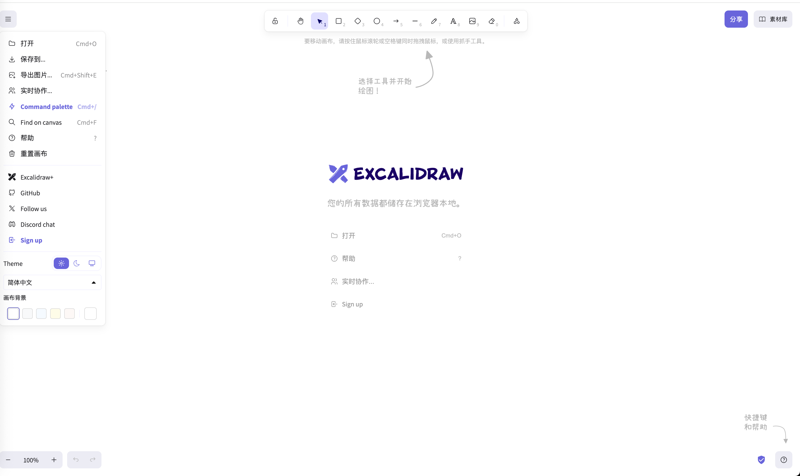

# Sky Canvas

<p align="center">
  
</p>

<p align="center">
  <strong>高性能 2D 图形渲染引擎</strong>
</p>

<p align="center">
  <a href="https://www.npmjs.com/package/@sky-canvas/render-engine"></a>
  <a href="https://github.com/sky-canvas/sky-canvas/actions/workflows/render-engine-ci.yml"></a>
  <a href="https://codecov.io/gh/sky-canvas/sky-canvas"></a>
  <a href="https://github.com/sky-canvas/sky-canvas/blob/main/LICENSE"></a>
</p>

<p align="center">
  <a href="#特性">特性</a> •
  <a href="#快速开始">快速开始</a> •
  <a href="#文档">文档</a> •
  <a href="#示例">示例</a> •
  <a href="#贡献">贡献</a> •
  <a href="#安全">安全</a>
</p>

---

## ✨ 特性

- 🚀 **高性能渲染** - 基于 WebGL/WebGPU 的硬件加速渲染,支持 Canvas2D 回退
- 📦 **批处理优化** - 智能批处理系统,大幅减少 Draw Calls
- 🎨 **丰富的效果** - 内置滤镜、混合模式、光照、蒙版等效果系统
- 🎬 **动画系统** - 完整的属性动画、路径动画、缓动函数支持
- ✨ **粒子系统** - GPU 加速的粒子系统,支持多种影响器
- 📝 **文本渲染** - 高质量文本渲染,支持富文本和国际化
- ⚡ **物理引擎** - 集成 Matter.js 物理引擎
- 🔌 **插件系统** - 灵活的插件架构,易于扩展
- 📊 **性能监控** - 内置性能分析和瓶颈检测
- 💪 **TypeScript** - 100% TypeScript 编写,完整的类型定义

## 📦 安装

```bash
# npm
npm install @sky-canvas/render-engine

# pnpm
pnpm add @sky-canvas/render-engine

# yarn
yarn add @sky-canvas/render-engine
```

## 🚀 快速开始

### 基础用法

```typescript
import { 
  RenderEngine, 
  Canvas2DContextFactory,
  Rectangle 
} from '@sky-canvas/render-engine';

// 获取 canvas 元素
const canvas = document.getElementById('canvas') as HTMLCanvasElement;

// 创建渲染引擎
const engine = new RenderEngine({
  targetFPS: 60,
  enableVSync: true,
  enableCulling: true
});

// 初始化
const factory = new Canvas2DContextFactory();
await engine.initialize(factory, canvas);

// 创建图层
const layer = engine.createLayer('main', 0);

// 创建可渲染对象
const rect = new Rectangle({
  x: 100,
  y: 100,
  width: 200,
  height: 150,
  fillColor: { r: 66, g: 133, b: 244, a: 1 },
  strokeColor: { r: 0, g: 0, b: 0, a: 1 },
  strokeWidth: 2
});

// 添加到图层
layer.addRenderable(rect);

// 启动渲染循环
engine.start();
```

### 使用动画

```typescript
import { 
  AnimationManager, 
  PropertyAnimation,
  EasingFunctions,
  EasingType 
} from '@sky-canvas/render-engine';

// 创建动画管理器
const animationManager = new AnimationManager();

// 创建属性动画
const animation = new PropertyAnimation({
  target: rect,
  property: 'x',
  from: 100,
  to: 500,
  duration: 1000,
  easing: EasingFunctions.get(EasingType.EASE_IN_OUT_CUBIC)
});

// 注册并启动动画
animationManager.registerAnimation(animation);
animation.start();
animationManager.start();
```

### 使用粒子系统

```typescript
import { ParticleSystem } from '@sky-canvas/render-engine';

// 创建粒子系统
const particles = new ParticleSystem({
  maxParticles: 1000,
  emission: {
    rate: 50,
    burst: [{ time: 0, count: 100 }]
  },
  particle: {
    lifetime: { min: 1, max: 3 },
    speed: { min: 50, max: 150 },
    size: { min: 5, max: 15 },
    color: { r: 255, g: 100, b: 50, a: 1 }
  }
});

// 设置发射位置
particles.setEmitterPosition(400, 300);

// 启动粒子系统
particles.start();
```

### 使用滤镜

```typescript
import { 
  FilterManager, 
  GaussianBlurFilter,
  BrightnessFilter 
} from '@sky-canvas/render-engine';

// 创建滤镜管理器
const filterManager = new FilterManager();

// 注册滤镜
filterManager.registerFilter('blur', new GaussianBlurFilter({ radius: 5 }));
filterManager.registerFilter('brightness', new BrightnessFilter({ amount: 1.2 }));

// 应用滤镜链
const result = await filterManager.applyFilterChain(
  imageData,
  ['blur', 'brightness']
);
```

## 📚 文档

- [文档导航](./docs/README.md)
- [架构文档](./docs/architecture/README.md)
- [渲染管线](./docs/architecture/render-pipeline.md)
- [插件系统](./docs/architecture/plugin-system.md)
- [交互系统](./docs/INTERACTION_SYSTEM.md)
- [数学库设计](./docs/MATH_LIBRARY.md)
- [Canvas SDK 架构](./packages/canvas-sdk/docs/ARCHITECTURE.md)
- [发布流程](./docs/RELEASING.md)
- [示例代码](./packages/render-engine/examples/README.md)
- [性能优化指南](./packages/render-engine/src/performance/README.md)
- [支持渠道](./SUPPORT.md)
- [项目治理](./GOVERNANCE.md)

## 🎮 示例

查看 [examples](./packages/render-engine/examples/) 目录获取更多示例:

| 示例 | 描述 |
|------|------|
| [basic-usage.ts](./packages/render-engine/examples/basic-usage.ts) | 基础渲染用法 |
| [animation-example.ts](./packages/render-engine/examples/animation-example.ts) | 动画系统示例 |
| [particle-system-example.ts](./packages/render-engine/examples/particle-system-example.ts) | 粒子系统示例 |
| [batch-rendering-example.ts](./packages/render-engine/examples/batch-rendering-example.ts) | 批量渲染示例 |
| [filter-effects-example.ts](./packages/render-engine/examples/filter-effects-example.ts) | 滤镜效果示例 |
| [interactive-example.ts](./packages/render-engine/examples/interactive-example.ts) | 交互示例 |

## 📦 包结构

| 包 | 描述 | 版本 |
|---|------|------|
| [@sky-canvas/render-engine](./packages/render-engine) | 核心渲染引擎 |  |
| [@sky-canvas/canvas-sdk](./packages/canvas-sdk) | 画布 SDK |  |

## 🏗️ 架构

```
┌─────────────────────────────────────────────────────────────┐
│                      Sky Canvas                              │
├─────────────────────────────────────────────────────────────┤
│  ┌─────────────┐  ┌─────────────┐  ┌─────────────┐         │
│  │  Animation  │  │  Particle   │  │   Effects   │         │
│  │   System    │  │   System    │  │   System    │         │
│  └──────┬──────┘  └──────┬──────┘  └──────┬──────┘         │
│         │                │                │                 │
│  ┌──────┴────────────────┴────────────────┴──────┐         │
│  │              Render Engine Core               │         │
│  │  ┌─────────┐  ┌─────────┐  ┌─────────┐       │         │
│  │  │  Layer  │  │  Batch  │  │ Culling │       │         │
│  │  │ Manager │  │ Manager │  │ System  │       │         │
│  │  └─────────┘  └─────────┘  └─────────┘       │         │
│  └──────────────────────┬────────────────────────┘         │
│                         │                                   │
│  ┌──────────────────────┴────────────────────────┐         │
│  │              Graphics Adapters                │         │
│  │  ┌─────────┐  ┌─────────┐  ┌─────────┐       │         │
│  │  │Canvas2D │  │  WebGL  │  │ WebGPU  │       │         │
│  │  └─────────┘  └─────────┘  └─────────┘       │         │
│  └───────────────────────────────────────────────┘         │
└─────────────────────────────────────────────────────────────┘
```

## 🤝 贡献

我们欢迎所有形式的贡献!请查看 [CONTRIBUTING.md](./CONTRIBUTING.md) 了解如何参与，并遵守 [CODE_OF_CONDUCT.md](./CODE_OF_CONDUCT.md)。

### 开发

```bash
# 克隆仓库
git clone https://github.com/sky-canvas/sky-canvas.git
cd sky-canvas

# 安装依赖
pnpm install

# 开发模式
pnpm dev

# 运行测试
pnpm test

# 构建
pnpm build
```

## 🔐 安全

如发现安全漏洞，请参考 [SECURITY.md](./SECURITY.md) 进行私下披露。

## 📄 许可证

[MIT](./LICENSE) © Sky Canvas Team

## 🙏 致谢

- [Matter.js](https://brm.io/matter-js/) - 物理引擎
- [gl-matrix](https://glmatrix.net/) - 矩阵运算
- [opentype.js](https://opentype.js.org/) - 字体解析

---

<p align="center">
  Made with ❤️ by the Sky Canvas Team
</p>
