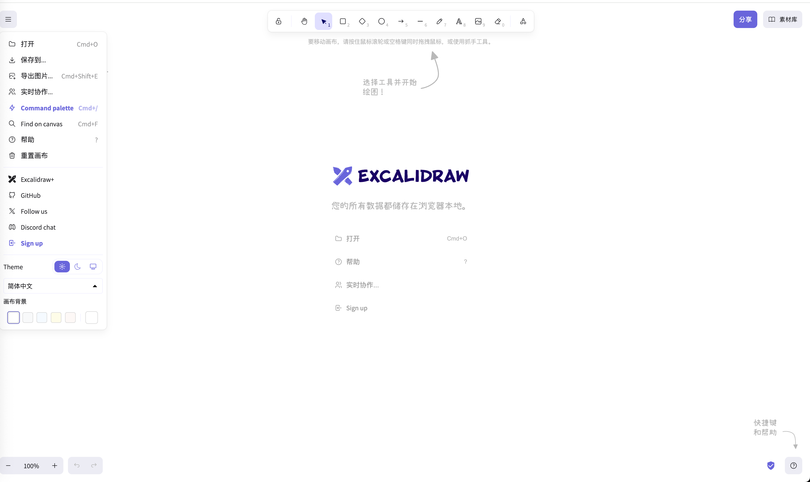

# Sky Canvas

<p align="center">
  
</p>

<p align="center">
  <strong>高性能 2D 图形渲染引擎与画布 SDK</strong>
</p>

<p align="center">
  <a href="https://www.npmjs.com/package/@sky-canvas/renderer"></a>
  <a href="https://github.com/echoVic/sky-canvas/actions/workflows/render-engine-ci.yml"></a>
  <a href="https://github.com/echoVic/sky-canvas/blob/main/LICENSE"></a>
  
  <a href="https://skills.sh/echoVic/sky-canvas"></a>
</p>

<p align="center">
  <a href="#特性">特性</a> •
  <a href="#快速开始">快速开始</a> •
  <a href="#包结构">包结构</a> •
  <a href="#架构">架构</a> •
  <a href="#文档">文档</a> •
  <a href="#贡献">贡献</a>
</p>

---

## ✨ 特性

### 渲染引擎 (render-engine)

- 🚀 **高性能渲染** - 基于 WebGL/WebGPU 的硬件加速渲染，支持 Canvas2D 回退
- 📦 **批处理优化** - 智能批处理系统，大幅减少 Draw Calls
- 🎨 **丰富的效果** - 内置滤镜、混合模式、光照、遮罩等效果系统
- 🎬 **动画系统** - 完整的属性动画、路径动画、时间轴、缓动函数支持
- ✨ **粒子系统** - GPU 加速的粒子系统，支持多种影响器（重力、风力、吸引子等）
- 📝 **文本渲染** - 高质量文本渲染，支持富文本、字体加载和国际化
- ⚡ **物理引擎** - 集成 Matter.js 物理引擎
- 📊 **性能监控** - 内置性能分析、瓶颈检测和基准测试

### 画布 SDK (canvas-sdk)

- 🎯 **MVVM 架构** - 基于 ViewModel + Manager + Service 的分层架构
- 💉 **依赖注入** - 基于 VSCode DI 架构的依赖注入系统
- 🔧 **工具系统** - 完整的绘图工具（选择、矩形、圆形、线条、文本等）
- 📋 **历史记录** - 完整的撤销/重做功能
- 🔌 **插件系统** - 灵活的插件架构，支持扩展点和生命周期管理
- 🤖 **AI 扩展** - 内置 AI 协议支持，便于集成智能功能

### 通用特性

- 💪 **TypeScript** - 100% TypeScript 编写，完整的类型定义
- 🧪 **测试覆盖** - 完善的单元测试和集成测试
- 📚 **文档完善** - 详细的 API 文档和架构说明
- 🌐 **框架无关** - 不依赖任何前端框架，可在任何 JavaScript 环境中使用

## 📦 安装

```bash
# 安装渲染引擎
pnpm add @sky-canvas/renderer

# 安装画布 SDK（包含渲染引擎）
pnpm add @sky-canvas/sdk
```

### Agent Skill

为 AI Agent 提供画布绘制能力（支持 Claude Code / OpenCode / Codex）：

```bash
npx skills add echoVic/sky-canvas --skill sky-draw
```

## 🚀 快速开始

### 使用渲染引擎

```typescript
import { 
  RenderEngine, 
  Canvas2DContextFactory,
  Rectangle 
} from '@sky-canvas/renderer';

// 获取 canvas 元素
const canvas = document.getElementById('canvas') as HTMLCanvasElement;

// 创建渲染引擎
const engine = new RenderEngine({
  targetFPS: 60,
  enableVSync: true,
  enableCulling: true
});

// 初始化
const factory = new Canvas2DContextFactory();
await engine.initialize(factory, canvas);

// 创建图层
const layer = engine.createLayer('main', 0);

// 创建可渲染对象
const rect = new Rectangle({
  x: 100,
  y: 100,
  width: 200,
  height: 150,
  fillColor: { r: 66, g: 133, b: 244, a: 1 },
  strokeColor: { r: 0, g: 0, b: 0, a: 1 },
  strokeWidth: 2
});

// 添加到图层
layer.addRenderable(rect);

// 启动渲染循环
engine.start();
```

### 使用画布 SDK

```typescript
import { CanvasSDK } from '@sky-canvas/sdk';

// 创建 SDK 实例
const sdk = new CanvasSDK();

// 初始化
const canvas = document.getElementById('canvas') as HTMLCanvasElement;
await sdk.initialize(canvas);

// 添加形状
sdk.addShape({
  id: 'rect1',
  type: 'rectangle',
  position: { x: 10, y: 20 },
  size: { width: 100, height: 80 },
  visible: true,
  zIndex: 0
});

// 监听事件
sdk.on('shapeSelected', (event) => {
  console.log('选中形状:', event.shape);
});

// 撤销/重做
sdk.undo();
sdk.redo();
```

### 使用动画系统

```typescript
import { 
  AnimationManager, 
  PropertyAnimation,
  EasingFunctions,
  EasingType 
} from '@sky-canvas/renderer';

const animationManager = new AnimationManager();

const animation = new PropertyAnimation({
  target: rect,
  property: 'x',
  from: 100,
  to: 500,
  duration: 1000,
  easing: EasingFunctions.get(EasingType.EASE_IN_OUT_CUBIC)
});

animationManager.registerAnimation(animation);
animation.start();
animationManager.start();
```

### 使用粒子系统

```typescript
import { ParticleSystem } from '@sky-canvas/renderer';

const particles = new ParticleSystem({
  maxParticles: 1000,
  emission: {
    rate: 50,
    burst: [{ time: 0, count: 100 }]
  },
  particle: {
    lifetime: { min: 1, max: 3 },
    speed: { min: 50, max: 150 },
    size: { min: 5, max: 15 },
    color: { r: 255, g: 100, b: 50, a: 1 }
  }
});

particles.setEmitterPosition(400, 300);
particles.start();
```

### 使用滤镜效果

```typescript
import { 
  FilterManager, 
  GaussianBlurFilter,
  BrightnessFilter 
} from '@sky-canvas/renderer';

const filterManager = new FilterManager();

filterManager.registerFilter('blur', new GaussianBlurFilter({ radius: 5 }));
filterManager.registerFilter('brightness', new BrightnessFilter({ amount: 1.2 }));

const result = await filterManager.applyFilterChain(
  imageData,
  ['blur', 'brightness']
);
```

## 📦 包结构

| 包 | 描述 | 版本 |
|---|------|------|
| [@sky-canvas/renderer](./packages/render-engine) | 核心渲染引擎 |  |
| [@sky-canvas/sdk](./packages/canvas-sdk) | 画布 SDK |  |

## 🏗️ 架构

```
┌─────────────────────────────────────────────────────────────────┐
│                        Sky Canvas                                │
├─────────────────────────────────────────────────────────────────┤
│                                                                  │
│  ┌─────────────────────────────────────────────────────────┐    │
│  │                    Canvas SDK                            │    │
│  │  ┌──────────┐  ┌──────────┐  ┌──────────┐  ┌─────────┐  │    │
│  │  │ViewModel │  │ Manager  │  │ Service  │  │   DI    │  │    │
│  │  │  Layer   │  │  Layer   │  │  Layer   │  │Container│  │    │
│  │  └──────────┘  └──────────┘  └──────────┘  └─────────┘  │    │
│  └─────────────────────────┬───────────────────────────────┘    │
│                            │                                     │
│  ┌─────────────────────────┴───────────────────────────────┐    │
│  │                   Render Engine                          │    │
│  │  ┌─────────┐  ┌─────────┐  ┌─────────┐  ┌─────────────┐ │    │
│  │  │Animation│  │Particle │  │ Effects │  │   Plugins   │ │    │
│  │  │ System  │  │ System  │  │ System  │  │   System    │ │    │
│  │  └────┬────┘  └────┬────┘  └────┬────┘  └──────┬──────┘ │    │
│  │       │            │            │              │         │    │
│  │  ┌────┴────────────┴────────────┴──────────────┴────┐   │    │
│  │  │              Render Pipeline Core                 │   │    │
│  │  │  ┌─────────┐  ┌─────────┐  ┌─────────┐           │   │    │
│  │  │  │  Layer  │  │  Batch  │  │ Culling │           │   │    │
│  │  │  │ Manager │  │ Manager │  │ System  │           │   │    │
│  │  │  └─────────┘  └─────────┘  └─────────┘           │   │    │
│  │  └──────────────────────┬────────────────────────────┘   │    │
│  │                         │                                 │    │
│  │  ┌──────────────────────┴────────────────────────────┐   │    │
│  │  │              Graphics Adapters                     │   │    │
│  │  │  ┌─────────┐  ┌─────────┐  ┌─────────┐            │   │    │
│  │  │  │Canvas2D │  │  WebGL  │  │ WebGPU  │            │   │    │
│  │  │  │(稳定)   │  │ (稳定)  │  │(开发中) │            │   │    │
│  │  │  └─────────┘  └─────────┘  └─────────┘            │   │    │
│  │  └───────────────────────────────────────────────────┘   │    │
│  └──────────────────────────────────────────────────────────┘    │
└─────────────────────────────────────────────────────────────────┘
```

### 数据流

```
用户交互 → ViewModel → Manager → Service → RenderPipeline → 渲染后端 → Canvas
```

## 📚 文档

### 入门指南

- [文档导航](./docs/README.md) - 文档总览
- [快速开始](#快速开始) - 快速上手示例

### 架构设计

- [架构概述](./docs/architecture/README.md) - 系统架构与设计原则
- [渲染管线](./docs/architecture/render-pipeline.md) - 渲染流程详解
- [插件系统](./docs/architecture/plugin-system.md) - 插件开发与扩展
- [Canvas SDK 架构](./packages/canvas-sdk/docs/ARCHITECTURE.md) - SDK 分层架构
- [MVVM 集成指南](./packages/canvas-sdk/docs/MVVM_INTEGRATION.md) - MVVM 模式详解

### 功能模块

- [交互系统](./docs/INTERACTION_SYSTEM.md) - 事件处理与交互
- [数学库设计](./docs/MATH_LIBRARY.md) - 向量、矩阵、变换
- [性能优化指南](./packages/render-engine/src/performance/README.md) - 性能调优
- [资源管理](./packages/render-engine/src/resources/README.md) - 资源加载与缓存
- [文本渲染](./packages/render-engine/src/text/RICH_TEXT.md) - 富文本支持
- [字体加载](./packages/render-engine/src/text/FONT_LOADING.md) - 字体管理

### 开发指南

- [贡献指南](./CONTRIBUTING.md) - 如何参与贡献
- [发布流程](./docs/RELEASING.md) - 版本发布指南
- [变更日志](./CHANGELOG.md) - 版本历史

### 社区

- [行为准则](./CODE_OF_CONDUCT.md) - 社区行为规范
- [支持渠道](./SUPPORT.md) - 获取帮助
- [项目治理](./GOVERNANCE.md) - 项目管理
- [安全政策](./SECURITY.md) - 安全漏洞报告

## 🎮 示例

查看 [examples](./packages/render-engine/examples/) 目录获取更多示例：

| 示例 | 描述 |
|------|------|
| [basic-usage.ts](./packages/render-engine/examples/basic-usage.ts) | 基础渲染用法 |
| [animation-example.ts](./packages/render-engine/examples/animation-example.ts) | 动画系统示例 |
| [particle-system-example.ts](./packages/render-engine/examples/particle-system-example.ts) | 粒子系统示例 |
| [batch-rendering-example.ts](./packages/render-engine/examples/batch-rendering-example.ts) | 批量渲染示例 |
| [filter-effects-example.ts](./packages/render-engine/examples/filter-effects-example.ts) | 滤镜效果示例 |
| [interactive-example.ts](./packages/render-engine/examples/interactive-example.ts) | 交互示例 |
| [framework-agnostic-rendering.html](./examples/framework-agnostic-rendering.html) | 框架无关渲染示例 |

## 🤝 贡献

我们欢迎所有形式的贡献！请查看 [CONTRIBUTING.md](./CONTRIBUTING.md) 了解如何参与。

### 开发环境

```bash
# 克隆仓库
git clone https://github.com/echoVic/sky-canvas.git
cd sky-canvas

# 安装依赖（需要 pnpm 8.0+）
pnpm install

# 开发模式
pnpm dev

# 运行测试
pnpm test

# 运行所有包的测试
pnpm test:packages

# 代码检查
pnpm lint

# 代码格式化
pnpm format

# 构建
pnpm build:packages
```

### 项目脚本

| 命令 | 描述 |
|------|------|
| `pnpm dev` | 启动开发服务器 |
| `pnpm build:packages` | 构建所有包 |
| `pnpm test` | 运行测试 |
| `pnpm test:watch` | 监听模式运行测试 |
| `pnpm test:coverage` | 生成测试覆盖率报告 |
| `pnpm lint` | 代码检查 |
| `pnpm format` | 代码格式化 |

## 🔐 安全

如发现安全漏洞，请参考 [SECURITY.md](./SECURITY.md) 进行私下披露。

## 📄 许可证

[MIT](./LICENSE) © Sky Canvas Team

## 🙏 致谢

- [Matter.js](https://brm.io/matter-js/) - 物理引擎
- [gl-matrix](https://glmatrix.net/) - 矩阵运算
- [opentype.js](https://opentype.js.org/) - 字体解析
- [Paper.js](http://paperjs.org/) - 矢量图形
- [Biome](https://biomejs.dev/) - 代码检查与格式化

---

<p align="center">
  Made with ❤️ by the Sky Canvas Team
</p>
