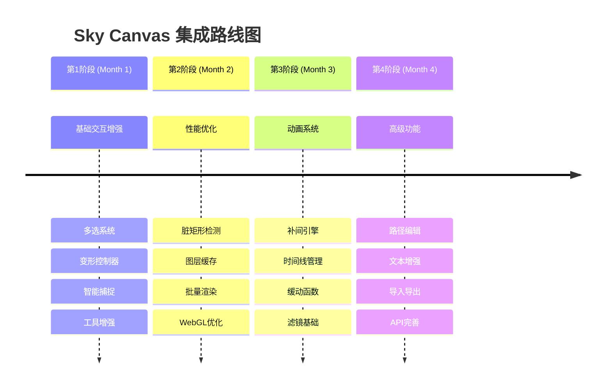

# Sky Canvas 主流引擎优点集成计划

> 将Fabric.js、Konva.js、PixiJS、Paper.js等主流2D渲染引擎的优点集成到Sky Canvas项目中

## 📋 项目概述

### 目标
在保持Sky Canvas现有三层架构优势的基础上，分阶段集成主流2D渲染引擎的核心优点，提升性能、交互体验和功能完整性。

### 集成原则
- ✅ **架构优先**: 保持三层分离架构，不破坏现有设计
- ✅ **性能导向**: 优先集成性能相关的优化功能
- ✅ **渐进增强**: 分阶段实施，确保每个版本都是稳定可用的
- ✅ **插件化**: 高级功能通过插件系统提供，保持核心轻量
- ✅ **框架无关**: 保持底层引擎的框架无关性

## 🗺️ 整体路线图



## 🚀 第一阶段：基础交互增强 (第1个月)

### 目标
提升基础用户交互体验，借鉴Fabric.js的成熟交互模式

### 1.1 多选系统重构 (Week 1)

#### 技术方案
- **文件位置**: `packages/canvas-sdk/src/interaction/MultiSelectManager.ts`
- **集成来源**: Fabric.js多选机制

```typescript
// 新增多选管理器
export class MultiSelectManager {
  private selectedShapes: Set<IShape> = new Set();
  private selectionBounds: Rectangle | null = null;
  
  // 批量操作接口
  selectMultiple(shapes: IShape[]): void;
  getSelectionBounds(): Rectangle;
  transformSelection(transform: Transform): void;
}
```

#### 验收标准
- [ ] 支持Ctrl+点击多选
- [ ] 支持拖拽框选
- [ ] 多选状态下的统一变形
- [ ] 选择状态可视化反馈

### 1.2 变形控制器实现 (Week 1-2)

#### 技术方案
- **文件位置**: `packages/canvas-sdk/src/interaction/TransformController.ts`
- **集成来源**: Fabric.js变形控制

```typescript
export class TransformController {
  private handles: TransformHandle[] = [];
  private targetShapes: IShape[] = [];
  
  // 8个控制点：4角 + 4边中点
  createHandles(shapes: IShape[]): TransformHandle[];
  handleResize(handle: TransformHandle, delta: IPoint): void;
  handleRotate(centerPoint: IPoint, angle: number): void;
  renderHandles(context: CanvasRenderingContext2D): void;
}
```

#### 验收标准
- [ ] 8个控制点正确显示
- [ ] 拖拽调整大小功能
- [ ] 旋转控制手柄
- [ ] 保持宽高比选项

### 1.3 智能捕捉系统 (Week 2-3)

#### 技术方案
- **文件位置**: `packages/canvas-sdk/src/interaction/SnapManager.ts`
- **集成来源**: Konva.js智能对齐

```typescript
export class SnapManager {
  private snapDistance = 10;
  private snapTypes = ['grid', 'objects', 'guides'];
  
  // 捕捉计算
  getSnapPosition(position: IPoint, shapes: IShape[]): SnapResult;
  renderSnapGuides(context: CanvasRenderingContext2D): void;
  
  // 捕捉类型
  enableGridSnap(enabled: boolean, gridSize?: number): void;
  enableObjectSnap(enabled: boolean): void;
  enableGuideSnap(enabled: boolean): void;
}
```

#### 验收标准
- [ ] 网格对齐功能
- [ ] 对象边缘对齐
- [ ] 中心点对齐
- [ ] 捕捉辅助线显示

### 1.4 工具系统增强 (Week 3-4)

#### 增强现有工具
- **CircleTool.ts**: 添加实时预览和约束绘制
- **RectangleTool.ts**: 支持圆角矩形
- **新增SelectTool.ts**: 专门的选择工具

#### 验收标准
- [ ] 所有绘图工具支持实时预览
- [ ] Shift键约束绘制（正圆、正方形）
- [ ] 工具状态管理完善
- [ ] 光标状态正确切换

### 📊 第一阶段成功指标
- **性能**: 1000个对象的多选操作 < 100ms
- **用户体验**: 变形操作响应延迟 < 16ms (60fps)
- **功能完整性**: 100%通过交互测试用例

## ⚡ 第二阶段：性能优化 (第2个月)

### 目标
大幅提升渲染性能，借鉴Konva.js和PixiJS的优化策略

### 2.1 脏矩形检测系统 (Week 1-2)

#### 技术方案
- **文件位置**: `packages/render-engine/src/core/DirtyRegionManager.ts`
- **集成来源**: Konva.js局部刷新机制

```typescript
export class DirtyRegionManager {
  private dirtyRegions: Rectangle[] = [];
  private lastFrameShapes: Map<string, ShapeSnapshot> = new Map();
  
  // 脏区域管理
  markRegionDirty(bounds: Rectangle, reason: string): void;
  optimizeDirtyRegions(): Rectangle[];
  shouldRedrawShape(shape: IShape): boolean;
  
  // 智能合并相邻区域
  mergeDirtyRegions(regions: Rectangle[]): Rectangle[];
}
```

#### 验收标准
- [ ] 只重绘变化区域
- [ ] 相邻脏区域自动合并
- [ ] 性能提升 > 50%（大场景）
- [ ] 调试模式可视化脏区域

### 2.2 图层缓存系统 (Week 2-3)

#### 技术方案
- **文件位置**: `packages/render-engine/src/core/LayerCache.ts`
- **集成来源**: PixiJS纹理缓存

```typescript
export class LayerCache {
  private cache: Map<string, HTMLCanvasElement> = new Map();
  private cachePolicy: CachePolicy;
  
  // 缓存管理
  cacheLayer(layerId: string, shapes: IShape[]): HTMLCanvasElement;
  invalidateCache(layerId: string): void;
  renderFromCache(layerId: string, context: CanvasRenderingContext2D): void;
  
  // 内存管理
  cleanupUnusedCache(): void;
  getCacheMemoryUsage(): number;
}
```

#### 验收标准
- [ ] 静态图层缓存功能
- [ ] 缓存失效策略完善
- [ ] 内存使用量监控
- [ ] 缓存命中率 > 80%

### 2.3 批量渲染优化 (Week 3-4)

#### 技术方案
- **文件位置**: `packages/render-engine/src/batching/AdvancedBatcher.ts`
- **集成来源**: PixiJS批量渲染

```typescript
export class AdvancedBatcher extends Batcher {
  private instancedShapes: Map<string, InstancedShape[]> = new Map();
  
  // 实例化渲染
  addInstancedShape(shape: IShape): void;
  renderInstancedBatch(shapeType: string): void;
  
  // 几何体合并
  mergeGeometry(shapes: IShape[]): MergedGeometry;
  renderMergedGeometry(geometry: MergedGeometry): void;
}
```

#### 验收标准
- [ ] 同类型形状批量渲染
- [ ] WebGL实例化渲染
- [ ] Draw Call数量减少 > 70%
- [ ] 帧率提升 > 2x（复杂场景）

### 📊 第二阶段成功指标
- **渲染性能**: 1000个对象场景保持60fps
- **内存使用**: 缓存内存占用 < 100MB
- **Draw Call**: 减少到原来的30%以下

## 🎬 第三阶段：动画系统 (第3个月)

### 目标
添加完整的动画支持，借鉴Konva.js的动画系统

### 3.1 补间动画引擎 (Week 1-2)

#### 技术方案
- **文件位置**: `packages/canvas-sdk/src/animation/TweenEngine.ts`
- **集成来源**: Konva.js动画系统

```typescript
export class TweenEngine {
  private activeAnimations: Map<string, Animation> = new Map();
  private timeline: number = 0;
  
  // 动画创建
  to(target: IShape, props: AnimatedProps, config: AnimationConfig): Animation;
  from(target: IShape, props: AnimatedProps, config: AnimationConfig): Animation;
  fromTo(target: IShape, fromProps: AnimatedProps, toProps: AnimatedProps, config: AnimationConfig): Animation;
  
  // 动画控制
  play(animationId: string): void;
  pause(animationId: string): void;
  stop(animationId: string): void;
  
  // 时间管理
  update(deltaTime: number): void;
}
```

#### 验收标准
- [ ] 基础属性补间（位置、大小、旋转、透明度）
- [ ] 多种缓动函数支持
- [ ] 动画链式调用
- [ ] 动画事件回调

### 3.2 时间线管理器 (Week 2-3)

#### 技术方案
- **文件位置**: `packages/canvas-sdk/src/animation/Timeline.ts`

```typescript
export class Timeline {
  private tracks: Map<string, AnimationTrack> = new Map();
  private duration: number = 0;
  private currentTime: number = 0;
  
  // 时间线构建
  add(animation: Animation, offset?: number): Timeline;
  addCallback(callback: () => void, time: number): Timeline;
  
  // 播放控制
  play(): void;
  pause(): void;
  seek(time: number): void;
  reverse(): void;
}
```

#### 验收标准
- [ ] 多动画同步播放
- [ ] 时间线搜索功能
- [ ] 循环播放支持
- [ ] 时间线可视化编辑器（可选）

### 3.3 滤镜系统基础 (Week 3-4)

#### 技术方案
- **文件位置**: `packages/render-engine/src/effects/FilterSystem.ts`
- **集成来源**: PixiJS滤镜管道

```typescript
export class FilterSystem {
  private filters: Map<string, IFilter> = new Map();
  private filterChain: FilterChain;
  
  // 内置滤镜
  createBlurFilter(radius: number): BlurFilter;
  createShadowFilter(offset: IPoint, blur: number, color: string): ShadowFilter;
  createColorMatrixFilter(matrix: number[]): ColorMatrixFilter;
  
  // 滤镜管道
  applyFilters(shape: IShape, filters: IFilter[]): void;
  renderWithFilters(shape: IShape, context: RenderContext): void;
}
```

#### 验收标准
- [ ] 基础滤镜效果（模糊、阴影、色彩调整）
- [ ] 滤镜链式组合
- [ ] 实时滤镜预览
- [ ] 滤镜性能优化

### 📊 第三阶段成功指标
- **动画性能**: 100个同时动画对象保持60fps
- **滤镜性能**: 基础滤镜渲染延迟 < 5ms
- **API易用性**: 动画API学习成本 < 30分钟

## 🎨 第四阶段：高级功能 (第4个月)

### 目标
完善高级图形功能，借鉴Paper.js的精确绘图能力

### 4.1 路径编辑器 (Week 1-2)

#### 技术方案
- **文件位置**: `packages/canvas-sdk/src/scene/AdvancedPathShape.ts`
- **集成来源**: Paper.js路径操作

```typescript
export class AdvancedPathShape extends PathShape {
  private controlPoints: PathPoint[] = [];
  private pathData: PathData;
  
  // 路径编辑
  addPoint(point: IPoint, type: 'smooth' | 'corner'): void;
  insertPoint(index: number, point: IPoint): void;
  removePoint(index: number): void;
  
  // 路径运算
  union(other: AdvancedPathShape): AdvancedPathShape;
  intersect(other: AdvancedPathShape): AdvancedPathShape;
  subtract(other: AdvancedPathShape): AdvancedPathShape;
  
  // 路径优化
  simplify(tolerance?: number): void;
  smooth(smoothness?: number): void;
}
```

#### 验收标准
- [ ] 贝塞尔曲线控制点编辑
- [ ] 路径布尔运算
- [ ] 路径简化和平滑
- [ ] SVG路径导入导出

### 4.2 文本编辑增强 (Week 2-3)

#### 技术方案
- **文件位置**: `packages/canvas-sdk/src/scene/RichTextShape.ts`
- **集成来源**: Fabric.js文本系统

```typescript
export class RichTextShape extends TextShape {
  private textRuns: TextRun[] = [];
  private isEditing: boolean = false;
  
  // 富文本支持
  applyFormat(range: TextRange, format: TextFormat): void;
  insertText(position: number, text: string): void;
  deleteText(range: TextRange): void;
  
  // 内联编辑
  startEditing(): void;
  endEditing(): void;
  updateCaretPosition(position: number): void;
}
```

#### 验收标准
- [ ] 双击进入文本编辑模式
- [ ] 富文本格式支持（粗体、斜体、颜色）
- [ ] 文本对齐和换行
- [ ] 字体加载管理

### 4.3 导入导出系统 (Week 3-4)

#### 技术方案
- **文件位置**: `packages/canvas-sdk/src/io/ImportExportManager.ts`

```typescript
export class ImportExportManager {
  // 格式支持
  exportToSVG(shapes: IShape[]): string;
  exportToPNG(canvas: HTMLCanvasElement, options?: ExportOptions): Blob;
  exportToJSON(scene: Scene): string;
  
  importFromSVG(svgData: string): IShape[];
  importFromJSON(jsonData: string): Scene;
  importFromImage(imageFile: File): Promise<ImageShape>;
}
```

#### 验收标准
- [ ] SVG导入导出
- [ ] PNG/JPG图片导出
- [ ] JSON场景序列化
- [ ] 批量导入处理

### 📊 第四阶段成功指标
- **功能完整性**: SVG兼容性 > 90%
- **文本编辑**: 响应延迟 < 50ms
- **导出质量**: 高DPI导出支持

## 📈 性能基准和成功指标

### 核心性能指标

| 指标类型 | 当前状态 | 目标值 | 测试场景 |
|---------|---------|-------|----------|
| 渲染性能 | 30fps (1000对象) | 60fps (1000对象) | 复杂场景渲染 |
| 交互延迟 | 100ms | 16ms | 多选和变形操作 |
| 内存使用 | 未优化 | <200MB | 大型场景缓存 |
| 启动时间 | 2s | 500ms | SDK初始化 |
| 包体积 | 1.5MB | <2MB | 全功能构建 |

### 用户体验指标

| 功能模块 | 易用性指标 | 学习成本 |
|---------|-----------|----------|
| 基础绘图 | 3次点击完成 | 5分钟 |
| 高级编辑 | 直观的视觉反馈 | 15分钟 |
| 动画制作 | API调用简洁 | 30分钟 |
| 插件开发 | 文档完整 | 2小时 |

## 🧪 测试策略

### 自动化测试
```bash
# 性能基准测试
pnpm test:performance

# 功能回归测试  
pnpm test:integration

# 兼容性测试
pnpm test:compatibility

# 内存泄漏测试
pnpm test:memory
```

### 手动测试场景
1. **大场景测试**: 5000+对象的复杂场景
2. **长时间运行**: 24小时连续使用测试
3. **多浏览器兼容**: Chrome, Firefox, Safari, Edge
4. **移动设备适配**: iOS Safari, Android Chrome

## 🚀 部署和发布计划

### 版本规划
- **v1.1.0** (Month 1): 基础交互增强
- **v1.2.0** (Month 2): 性能优化
- **v1.3.0** (Month 3): 动画系统
- **v1.4.0** (Month 4): 高级功能

### 发布策略
- **Beta测试**: 每个阶段结束后发布Beta版本
- **文档同步**: 功能开发与文档更新同步进行
- **社区反馈**: 建立反馈收集机制
- **兼容性保证**: 向后兼容性承诺

## 🔄 持续改进计划

### 第二轮优化 (Month 5-6)
- WebGPU渲染后端完善
- 多线程渲染优化
- AI辅助绘图功能
- 协作编辑支持

### 生态建设 (Long-term)
- 插件市场建设
- 第三方工具集成
- 开发者社区建设
- 商业化功能规划

---

**最后更新**: 2024-09-03  
**文档版本**: v1.0  
**维护人员**: Sky Canvas Team