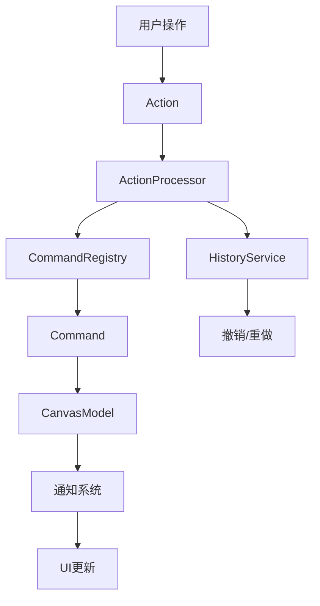

# Command-Action 系统 API 文档

## 概述

Command-Action 系统是 Sky Canvas 的核心架构模式，实现了操作与执行的分离，提供了强大的撤销/重做功能和灵活的扩展机制。

## 架构图



## 核心类型

### Action

操作描述对象，包含操作类型、参数和元数据。

```typescript
interface Action {
  type: string;                    // 操作类型
  payload: Record<string, any>;    // 操作参数
  metadata: {
    timestamp: number;             // 时间戳
    source: 'user' | 'system' | 'plugin'; // 操作源
    id?: string;                   // 唯一标识符
    batch?: boolean;               // 是否为批量操作
  };
}
```

#### 内置 Action 类型

##### 形状操作

- `ADD_RECTANGLE` - 添加矩形
- `ADD_CIRCLE` - 添加圆形
- `ADD_TEXT` - 添加文本
- `ADD_PATH` - 添加路径
- `ADD_DIAMOND` - 添加菱形
- `UPDATE_SHAPE` - 更新形状
- `DELETE_SHAPE` - 删除形状
- `DELETE_SELECTED` - 删除选中形状

##### 选择操作

- `SELECT_SHAPES` - 选择形状
- `DESELECT_SHAPE` - 取消选择
- `CLEAR_SELECTION` - 清空选择
- `SELECT_ALL` - 全选
- `INVERT_SELECTION` - 反选

##### Z-Index 操作

- `BRING_TO_FRONT` - 置于顶层
- `SEND_TO_BACK` - 置于底层
- `BRING_FORWARD` - 上移一层
- `SEND_BACKWARD` - 下移一层
- `SET_Z_INDEX` - 设置层级

### Command

命令接口，负责执行具体的操作。

```typescript
interface Command {
  execute(): Promise<void>;        // 执行命令
  undo(): Promise<void>;          // 撤销命令
  toString(): string;             // 描述字符串
}
```

### ActionResult

Action 处理结果。

```typescript
interface ActionResult {
  success: boolean;               // 是否成功
  command?: Command;              // 执行的命令
  error?: string;                // 错误信息
  executionTime: number;         // 执行时间（毫秒）
  metadata?: {                   // 额外元数据
    retryCount?: number;
    warnings?: string[];
  };
}
```

## 核心组件

### ActionProcessor

Action 处理器，负责 Action 的处理和 Command 的执行。

#### 构造函数

```typescript
constructor(
  model: CanvasModel,
  options?: {
    enableValidation?: boolean;    // 启用验证（默认 true）
    enableLogging?: boolean;       // 启用日志（默认 false）
    historyService?: HistoryService; // 历史服务
    errorRetry?: {                 // 错误重试配置
      maxRetries: number;          // 最大重试次数
      retryableErrors: string[];   // 可重试的错误类型
      backoffMs: number;           // 退避时间
    };
  }
)
```

#### 主要方法

##### process(action: Action): Promise<ActionResult>

处理单个 Action。

```typescript
const action: Action = {
  type: 'ADD_RECTANGLE',
  payload: {
    x: 100,
    y: 100,
    width: 200,
    height: 150,
    style: { fill: '#ff6b6b', stroke: '#333' }
  },
  metadata: {
    timestamp: Date.now(),
    source: 'user'
  }
};

const result = await processor.process(action);
if (result.success) {
  console.log('操作成功执行');
} else {
  console.error('操作失败:', result.error);
}
```

##### undo(): Promise<boolean>

撤销上一个操作。

```typescript
const success = await processor.undo();
if (success) {
  console.log('撤销成功');
}
```

##### redo(): Promise<boolean>

重做上一个被撤销的操作。

```typescript
const success = await processor.redo();
if (success) {
  console.log('重做成功');
}
```

##### getHistoryStats()

获取历史记录统计信息。

```typescript
const stats = processor.getHistoryStats();
console.log(`历史记录: ${stats.historySize}, 可撤销: ${stats.canUndo}, 可重做: ${stats.canRedo}`);
```

#### 事件系统

ActionProcessor 继承自 EventEmitter，支持以下事件：

```typescript
// Action 接收事件
processor.on('action-received', (action: Action) => {
  console.log('收到 Action:', action.type);
});

// 命令创建事件
processor.on('command-created', (command: Command, action: Action) => {
  console.log('创建命令:', command.toString());
});

// 命令执行成功事件
processor.on('command-executed', (command: Command, result: ActionResult) => {
  console.log('命令执行成功');
});

// 命令执行失败事件
processor.on('command-failed', (command: Command, error: Error) => {
  console.log('命令执行失败:', error.message);
});

// Action 错误事件
processor.on('action-error', (action: Action, error: Error) => {
  console.log('Action 处理错误');
});

// Action 重试事件
processor.on('action-retry', (action: Action, attempt: number) => {
  console.log(`Action 重试，第 ${attempt} 次`);
});
```

### CommandRegistry

命令注册表，管理 Action 类型到 Command 的映射。

#### 注册命令

```typescript
import { commandRegistry } from '@sky-canvas/canvas-sdk';

// 单个注册
commandRegistry.register('CUSTOM_ACTION', {
  factory: (model: CanvasModel, action: Action) => {
    return new CustomCommand(model, action.payload);
  },
  description: '自定义操作',
  category: 'custom',
  version: '1.0.0'
});

// 批量注册
commandRegistry.registerBatch({
  'ACTION_1': {
    factory: (model, action) => new Command1(model, action.payload)
  },
  'ACTION_2': {
    factory: (model, action) => new Command2(model, action.payload)
  }
});

// 插件注册
commandRegistry.registerPlugin('my-plugin', {
  'PLUGIN_ACTION': {
    factory: (model, action) => new PluginCommand(model, action.payload)
  }
});
```

#### 查询方法

```typescript
// 检查支持的 Action 类型
const supported = commandRegistry.supports('ADD_RECTANGLE'); // true

// 获取所有已注册类型
const types = commandRegistry.getRegisteredTypes();

// 获取统计信息
const stats = commandRegistry.getStats();
console.log(`总命令数: ${stats.totalCommands}, 插件数: ${stats.totalPlugins}`);
```

### CanvasModel

画布数据模型，管理形状和选择状态。

#### 查询方法

```typescript
// 获取形状
const shape = model.getShape(id);
const allShapes = model.getShapes();
const shapeIds = model.getShapeIds();

// 查询状态
const exists = model.hasShape(id);
const selected = model.isSelected(id);
const count = model.getShapeCount();

// 选择相关
const selectedIds = model.getSelection();
const selectedShapes = model.getSelectedShapes();
const selectionCount = model.getSelectionCount();
```

#### 通知系统

```typescript
// 订阅模型变化
const unsubscribe = model.subscribe((change: ChangeDescription) => {
  console.log('模型变化:', change.type);

  switch (change.type) {
    case 'shape-added':
      console.log('形状已添加:', change.shapeId);
      break;
    case 'shape-removed':
      console.log('形状已删除:', change.shapeId);
      break;
    case 'selection-changed':
      console.log('选择已更改:', change.shapeIds);
      break;
  }
});

// 取消订阅
unsubscribe();
```

#### 批量操作

```typescript
// 开始批量操作
model.beginBatch();

// 执行多个操作...
model.addShape(shape1);
model.addShape(shape2);
model.setSelection([shape1.id, shape2.id]);

// 结束批量操作（触发批量通知）
model.endBatch();
```

## Command 基类

### BaseCommand

所有命令的基类，提供公共功能。

```typescript
abstract class BaseCommand implements Command {
  protected model: CanvasModel;
  public readonly description: string;

  constructor(model: CanvasModel, description: string);

  abstract execute(): Promise<void>;
  abstract undo(): Promise<void>;

  // 重做（默认调用 execute）
  async redo(): Promise<void>;

  // 执行状态
  isCommandExecuted(): boolean;

  toString(): string;
}
```

### AsyncCommand

异步命令基类，支持进度跟踪和中断。

```typescript
abstract class AsyncCommand extends BaseCommand {
  // 获取进度
  getProgress(): { current: number; total: number };

  // 中断命令
  abort(): void;

  // 检查是否被中断
  protected checkAborted(): void;

  // 更新进度
  protected updateProgress(current: number, total?: number): void;
}
```

### CompositeCommand

复合命令，可以包含多个子命令。

```typescript
class CompositeCommand extends BaseCommand {
  // 添加子命令
  add(command: Command): this;

  // 清空子命令
  clear(): void;

  // 获取大小
  size(): number;
  isEmpty(): boolean;
}
```

### BatchCommand

批量命令，支持并发执行和进度跟踪。

```typescript
class BatchCommand extends AsyncCommand {
  constructor(model: CanvasModel, commands: Command[]);
}
```

## 内置命令类

### AddShapeCommand

添加形状命令。

```typescript
class AddShapeCommand extends SyncCommand {
  constructor(model: CanvasModel, shapeData: ShapeData);

  // 获取创建的形状
  getShape(): Shape;
  getShapeId(): string;
}
```

### UpdateShapeCommand

更新形状命令。

```typescript
class UpdateShapeCommand extends SyncCommand {
  constructor(model: CanvasModel, shapeId: string, updates: Partial<ShapeData>);
}
```

### SelectShapesCommand

选择形状命令。

```typescript
class SelectShapesCommand extends SyncCommand {
  constructor(model: CanvasModel, shapeIds: string[], addToSelection?: boolean);
}
```

## 使用示例

### 基本使用

```typescript
import { ActionProcessor, CanvasModel } from '@sky-canvas/canvas-sdk';

// 创建模型和处理器
const model = new CanvasModel();
const processor = new ActionProcessor(model);

// 处理 Action
const addRectAction: Action = {
  type: 'ADD_RECTANGLE',
  payload: {
    x: 50,
    y: 50,
    width: 100,
    height: 80,
    style: { fill: '#3b82f6' }
  },
  metadata: {
    timestamp: Date.now(),
    source: 'user'
  }
};

const result = await processor.process(addRectAction);
console.log('添加矩形:', result.success);

// 撤销操作
await processor.undo();
console.log('形状数量:', model.getShapeCount()); // 0
```

### 批量操作

```typescript
const actions: Action[] = [
  {
    type: 'ADD_RECTANGLE',
    payload: { x: 0, y: 0, width: 50, height: 50 },
    metadata: { timestamp: Date.now(), source: 'user' }
  },
  {
    type: 'ADD_CIRCLE',
    payload: { x: 100, y: 100, radius: 30 },
    metadata: { timestamp: Date.now(), source: 'user' }
  }
];

// 顺序执行
for (const action of actions) {
  await processor.process(action);
}

// 或使用批量 Action
const batchAction: Action = {
  type: 'BATCH',
  payload: {
    actions,
    transactional: true,
    description: '批量添加形状'
  },
  metadata: { timestamp: Date.now(), source: 'user' }
};

await processor.process(batchAction);
```

### 自定义命令

```typescript
class CustomCommand extends BaseCommand {
  private customData: any;

  constructor(model: CanvasModel, data: any) {
    super(model, 'Custom Operation');
    this.customData = data;
  }

  async execute(): Promise<void> {
    // 执行自定义逻辑
    console.log('执行自定义操作:', this.customData);
    this.markAsExecuted();
  }

  async undo(): Promise<void> {
    // 撤销自定义逻辑
    console.log('撤销自定义操作');
    this.markAsNotExecuted();
  }
}

// 注册自定义命令
commandRegistry.register('CUSTOM_OPERATION', {
  factory: (model, action) => new CustomCommand(model, action.payload),
  description: '自定义操作',
  category: 'custom'
});

// 使用自定义命令
const customAction: Action = {
  type: 'CUSTOM_OPERATION',
  payload: { customParam: 'value' },
  metadata: { timestamp: Date.now(), source: 'user' }
};

await processor.process(customAction);
```

### 错误处理和重试

```typescript
const processor = new ActionProcessor(model, {
  errorRetry: {
    maxRetries: 3,
    retryableErrors: ['NetworkError', 'TimeoutError'],
    backoffMs: 1000
  }
});

processor.on('action-retry', (action, attempt) => {
  console.log(`重试 ${action.type}，第 ${attempt} 次`);
});

processor.on('action-error', (action, error) => {
  console.log(`Action ${action.type} 最终失败:`, error.message);
});
```

### 进度跟踪

```typescript
class ProgressTrackingCommand extends AsyncCommand {
  async execute(): Promise<void> {
    this.updateProgress(0, 100);

    for (let i = 1; i <= 100; i++) {
      // 检查是否被中断
      this.checkAborted();

      // 模拟工作
      await new Promise(resolve => setTimeout(resolve, 10));

      // 更新进度
      this.updateProgress(i);
    }

    this.markAsExecuted();
  }

  async undo(): Promise<void> {
    this.markAsNotExecuted();
  }
}

// 监听进度
const command = new ProgressTrackingCommand(model, 'Progress Test');
command.on('progress', (current, total) => {
  console.log(`进度: ${current}/${total} (${Math.round(current/total*100)}%)`);
});

// 可以中断
setTimeout(() => command.abort(), 500);
```

## 最佳实践

### 1. Action 设计

- 保持 Action 的不可变性
- 使用描述性的类型名称
- 在 payload 中包含所有必要信息
- 设置合适的 metadata

### 2. Command 实现

- 继承合适的基类
- 实现幂等的 execute 和 undo 方法
- 处理异常情况
- 提供有意义的描述信息

### 3. 性能优化

- 使用批量操作减少通知频率
- 合理设计命令的粒度
- 避免在 Command 中进行重型计算

### 4. 错误处理

- 实现适当的错误重试机制
- 提供清晰的错误信息
- 记录操作日志便于调试

### 5. 内存管理

- 及时清理不再需要的命令
- 限制历史记录的大小
- 注意事件监听器的清理

## API 参考总结

### 核心接口

| 接口 | 描述 | 主要方法 |
|------|------|----------|
| `Action` | 操作描述 | `type`, `payload`, `metadata` |
| `Command` | 命令执行 | `execute()`, `undo()`, `toString()` |
| `ActionResult` | 执行结果 | `success`, `command`, `error` |

### 核心类

| 类 | 描述 | 主要功能 |
|----|------|----------|
| `ActionProcessor` | Action 处理器 | 处理 Action，管理历史 |
| `CommandRegistry` | 命令注册表 | 注册和创建命令 |
| `CanvasModel` | 数据模型 | 管理形状和状态 |
| `BaseCommand` | 命令基类 | 通用命令功能 |
| `AsyncCommand` | 异步命令基类 | 进度跟踪，中断支持 |

### 事件类型

| 事件 | 触发时机 | 参数 |
|------|----------|------|
| `action-received` | 收到 Action | `(action: Action)` |
| `command-created` | 命令创建 | `(command: Command, action: Action)` |
| `command-executed` | 命令执行成功 | `(command: Command, result: ActionResult)` |
| `command-failed` | 命令执行失败 | `(command: Command, error: Error)` |
| `action-retry` | Action 重试 | `(action: Action, attempt: number)` |