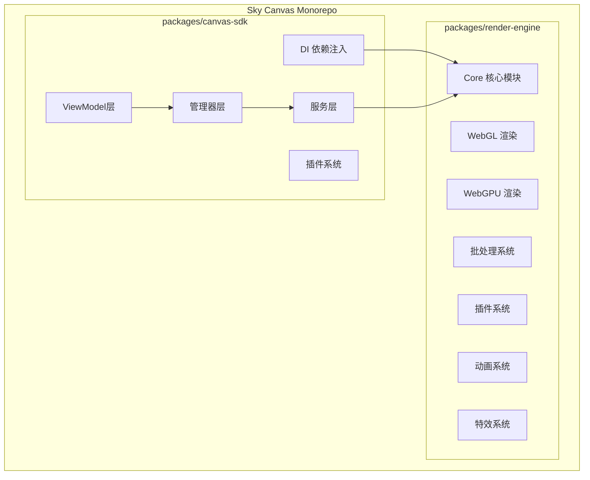
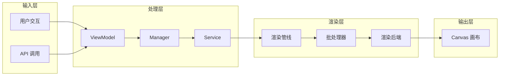
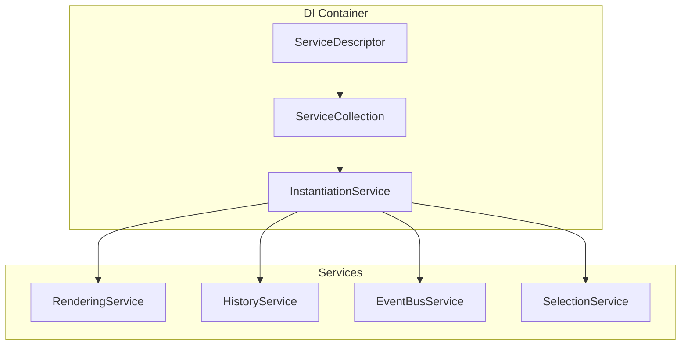
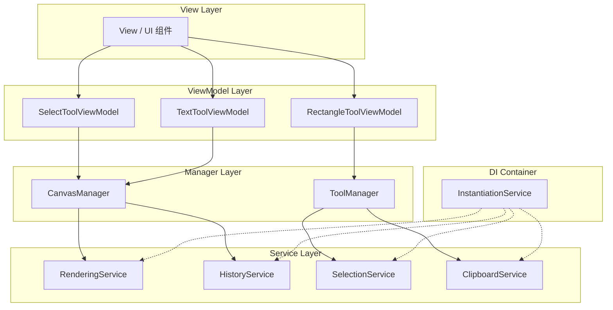
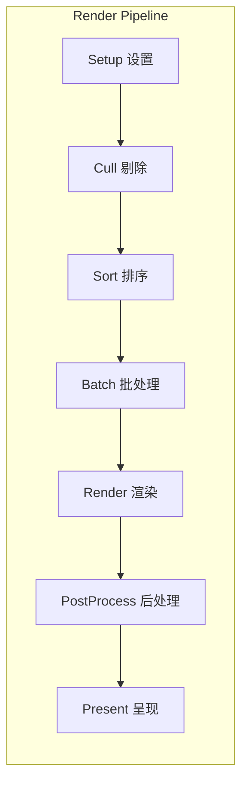
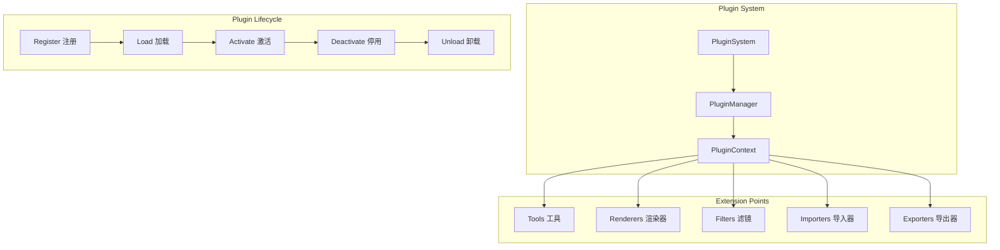
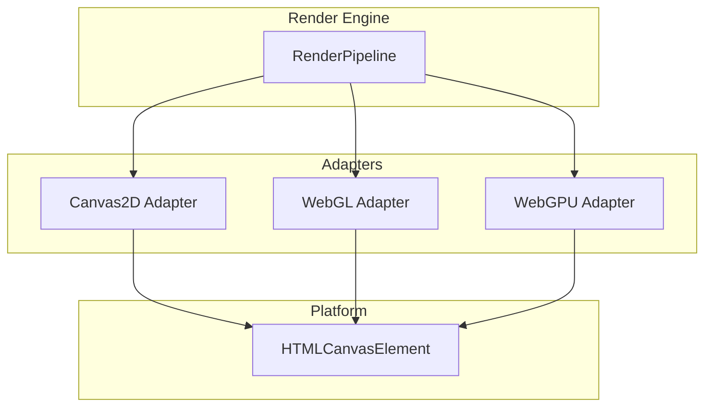
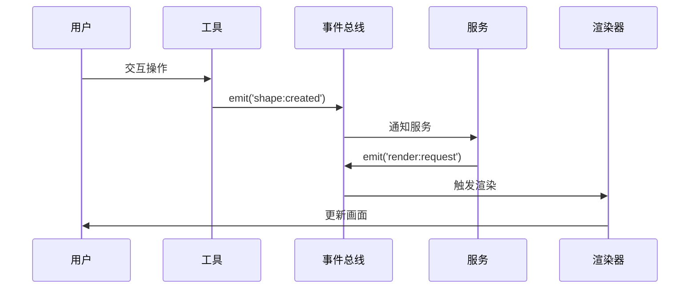

# Sky Canvas 系统架构概述

## 项目简介

Sky Canvas 是一个高性能的图形渲染引擎核心库，采用模块化的 Monorepo 架构设计，支持 Canvas2D、WebGL 和 WebGPU 多种渲染后端。

## 模块结构



## 核心包说明

| 包名 | 描述 | 主要功能 |
|------|------|----------|
| `@sky-canvas/render-engine` | 渲染引擎核心 | 图形渲染、批处理、WebGL/WebGPU 支持 |
| `@sky-canvas/canvas-sdk` | 画布功能 SDK | 场景管理、交互处理、工具系统 |

## 整体数据流



## 核心概念

### 1. 依赖注入 (DI) 系统

基于 VSCode DI 架构的依赖注入系统，实现组件解耦和可测试性：



**核心组件**：
- **ServiceIdentifier**: 服务标识符，唯一标识一个服务
- **ServiceDescriptor**: 服务描述符，定义服务的创建方式
- **InstantiationService**: 实例化服务，负责创建和管理服务实例
- **ServiceCollection**: 服务集合，存储服务描述符

### 2. 分层架构

采用 **MVVM + Manager + DI** 模式：



**分层策略**：
- **简单场景**: ViewModel 直接使用单个 Service
- **复杂场景**: ViewModel 通过 Manager 协调多个 Services
- **扩展场景**: 通过插件系统增强功能

### 3. 渲染管线

多阶段渲染管线，支持批处理和性能优化：



详细信息请参阅 [渲染管线详解](./render-pipeline.md)。

### 4. 插件系统

可扩展的插件架构，支持多种扩展点：



详细信息请参阅 [插件系统架构](./plugin-system.md)。

## 渲染后端支持



| 后端 | 状态 | 特点 |
|------|------|------|
| Canvas2D | 稳定 | 兼容性好，适合简单场景 |
| WebGL | 稳定 | 高性能，支持着色器 |
| WebGPU | 开发中 | 下一代图形 API，更高性能 |

## 事件系统

基于发布-订阅模式的事件总线：



## 目录结构

```
sky-canvas/
├── packages/
│   ├── render-engine/           # 渲染引擎核心
│   │   ├── src/
│   │   │   ├── core/            # 核心模块
│   │   │   │   ├── systems/     # 系统管理
│   │   │   │   └── renderers/   # 渲染器
│   │   │   ├── webgl/           # WebGL 实现
│   │   │   ├── adapters/        # 渲染适配器
│   │   │   │   └── webgpu/      # WebGPU 适配器
│   │   │   ├── batch/           # 批处理系统
│   │   │   ├── plugins/         # 插件系统
│   │   │   ├── animation/       # 动画系统
│   │   │   ├── effects/         # 特效系统
│   │   │   ├── math/            # 数学库
│   │   │   ├── events/          # 事件系统
│   │   │   └── utils/           # 工具函数
│   │   └── tests/               # 测试文件
│   │
│   └── canvas-sdk/              # 画布 SDK
│       ├── src/
│       │   ├── di/              # 依赖注入系统
│       │   ├── services/        # 服务层
│       │   ├── managers/        # 管理器层
│       │   ├── viewmodels/      # ViewModel 层
│       │   ├── plugins/         # 插件系统
│       │   └── tools/           # 工具实现
│       └── tests/               # 测试文件
│
├── docs/                        # 文档
│   ├── architecture/            # 架构文档
│   └── api/                     # API 文档
│
└── examples/                    # 示例项目
```

## 技术栈

- **语言**: TypeScript (严格模式)
- **构建工具**: Vite + TSC
- **包管理**: pnpm (Monorepo)
- **测试框架**: Vitest
- **图形 API**: Canvas2D / WebGL / WebGPU

## 设计原则

1. **SOLID 原则**: 组件设计符合单一职责原则
2. **DRY 原则**: 通过提取和重用代码，避免重复
3. **可复用性**: 组件可在不同上下文中重用
4. **可扩展性**: 结构能够轻松应对未来功能扩展
5. **类型安全**: 使用 TypeScript 严格模式保证类型安全

## 相关文档

- [渲染管线详解](./render-pipeline.md)
- [插件系统架构](./plugin-system.md)
