# 插件系统架构

## 概述

Sky Canvas 插件系统是一个强大且灵活的扩展框架，允许开发者创建自定义功能来扩展画布应用的能力。系统提供完整的生命周期管理、权限控制、API 访问和扩展点机制。

## 系统架构

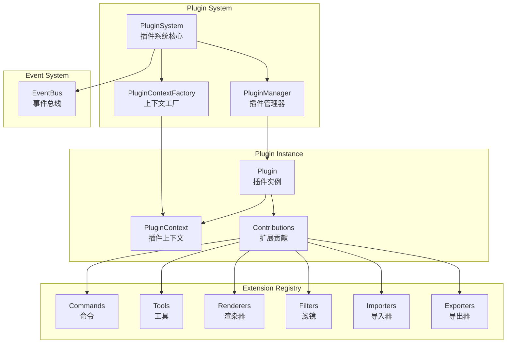

## 插件生命周期

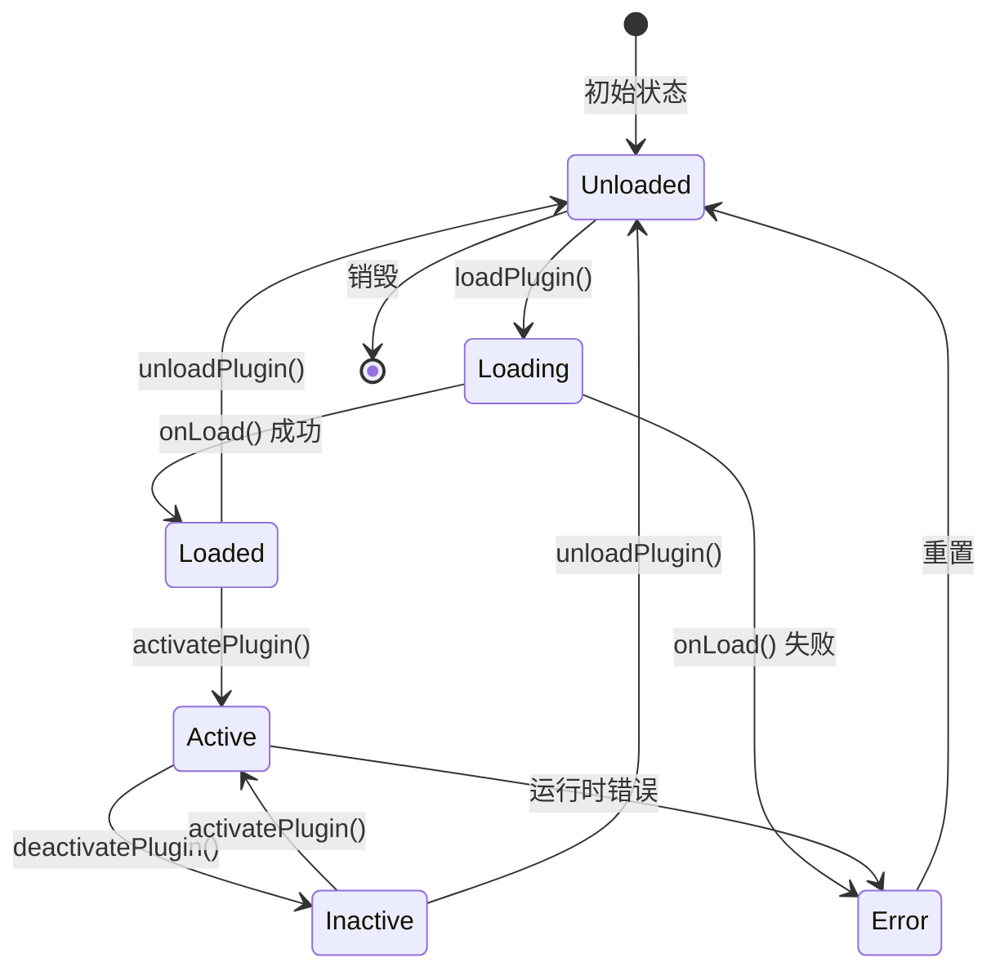

### 生命周期钩子

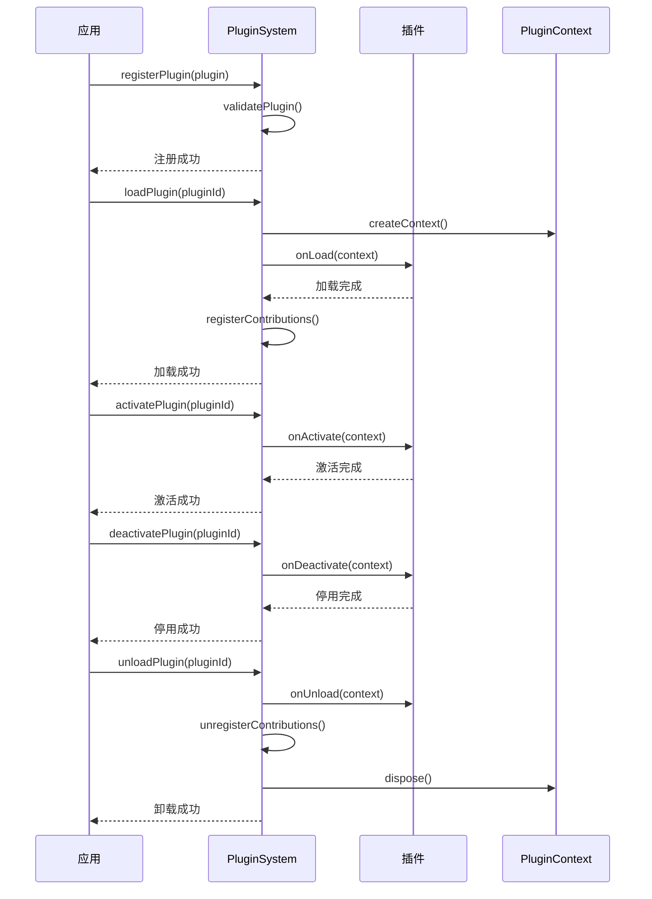

## 插件元数据

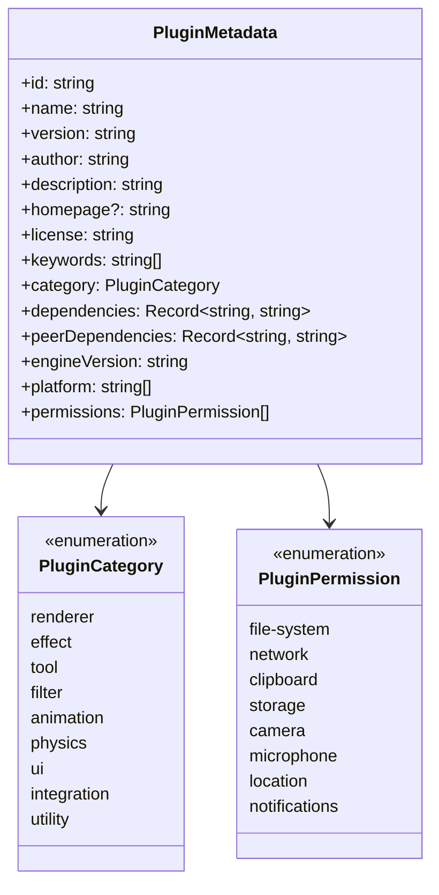

## 扩展点系统

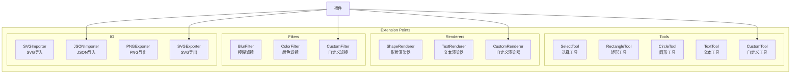

### 扩展点类型

| 扩展点 | 描述 | 用途 |
|--------|------|------|
| `commands` | 命令扩展 | 添加可执行的命令 |
| `tools` | 工具扩展 | 添加绘图工具 |
| `renderers` | 渲染器扩展 | 自定义渲染逻辑 |
| `filters` | 滤镜扩展 | 图像处理效果 |
| `animations` | 动画扩展 | 自定义动画效果 |
| `importers` | 导入器扩展 | 支持新的文件格式导入 |
| `exporters` | 导出器扩展 | 支持新的文件格式导出 |

## 插件上下文

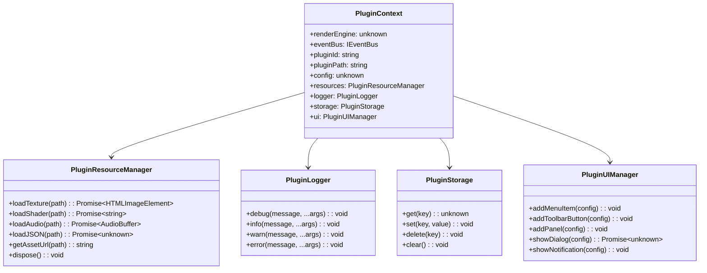

## 插件贡献

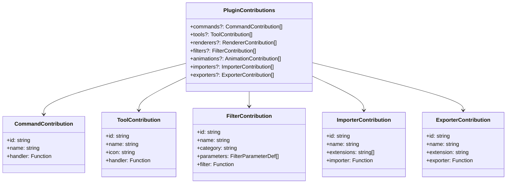

## 插件开发 SDK

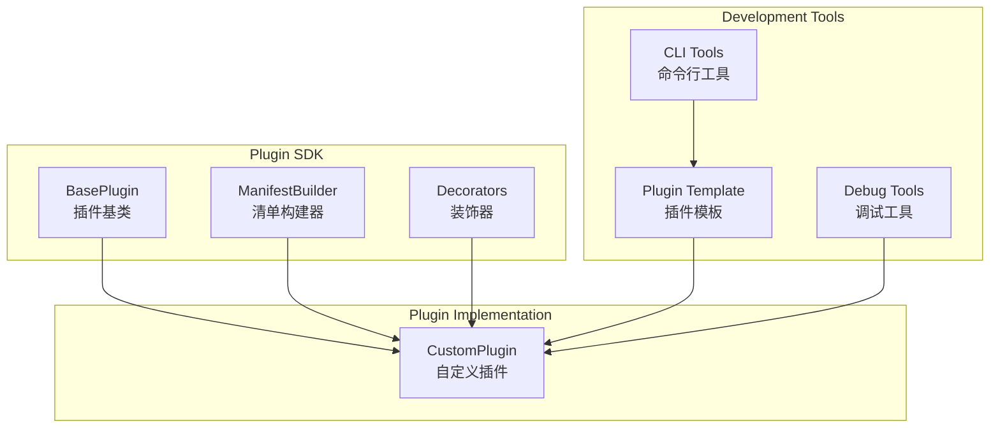

### 插件基类

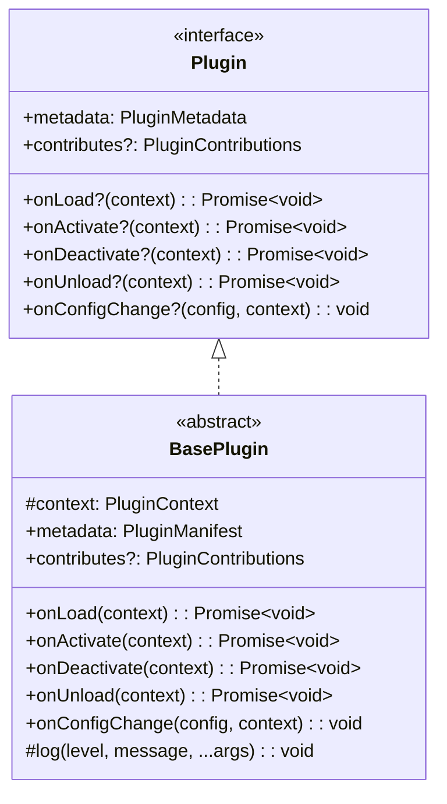

## 插件管理器

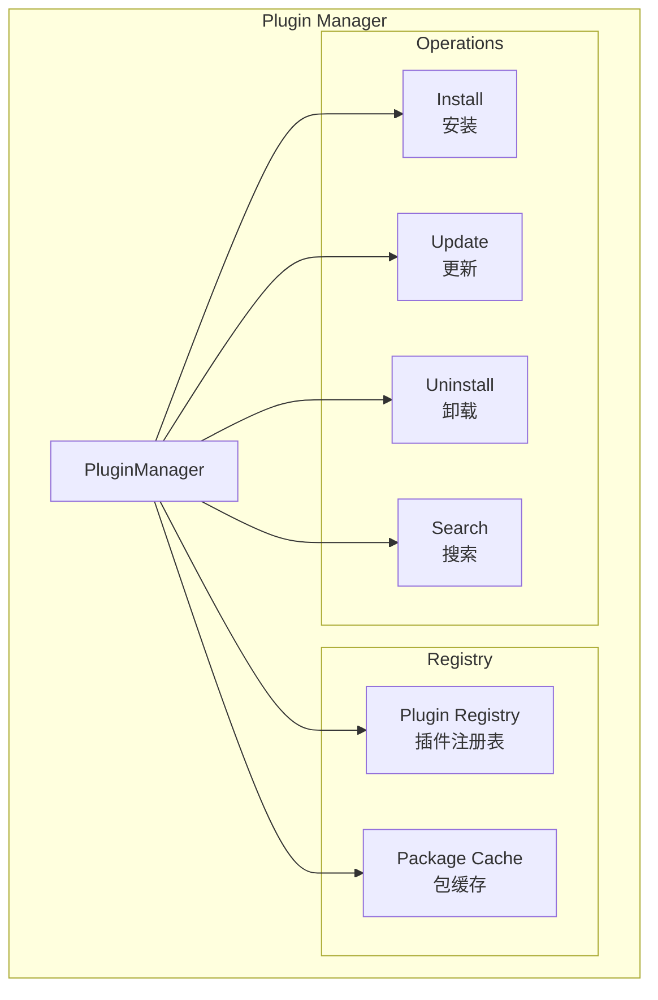

### 插件注册表

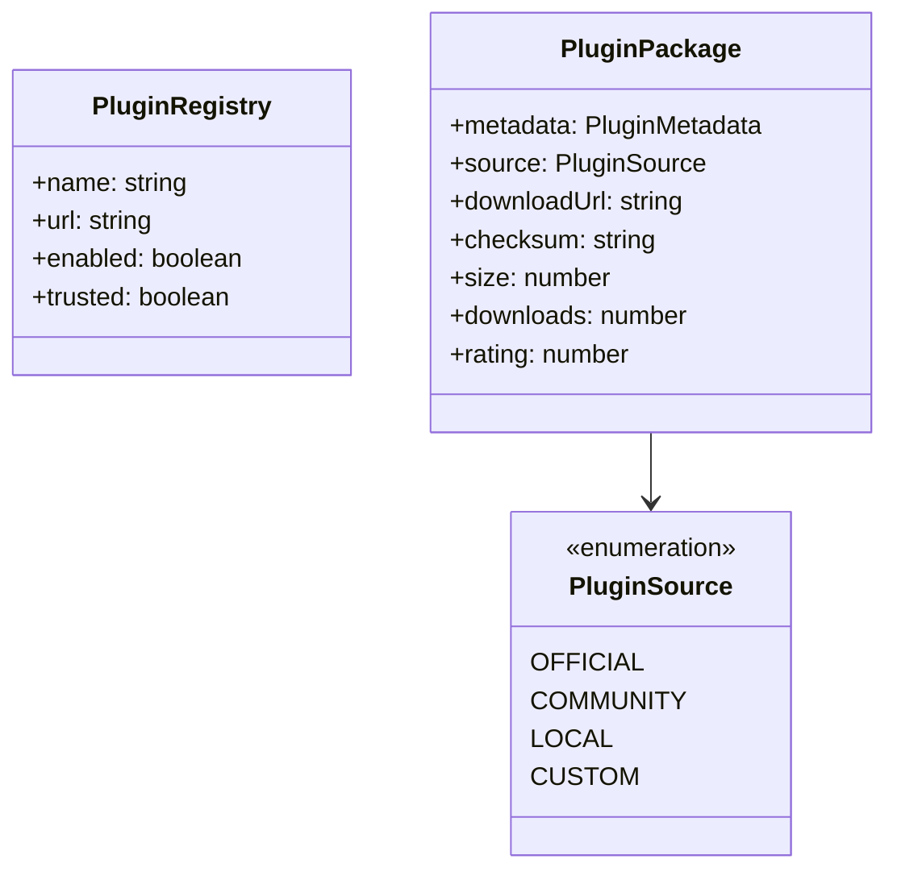

## 事件系统集成

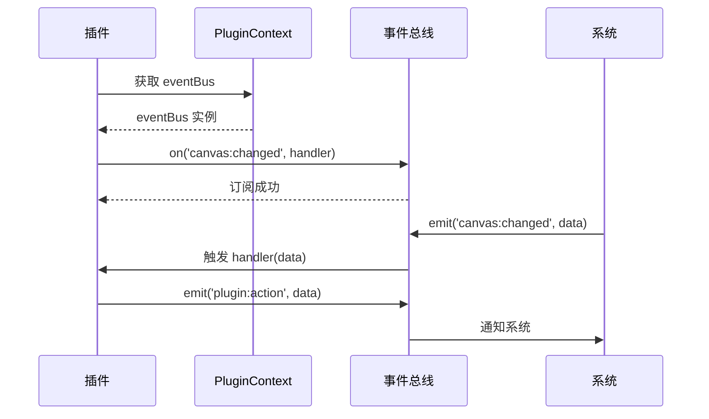

### 插件事件

| 事件 | 描述 | 数据 |
|------|------|------|
| `plugin-registered` | 插件注册 | `{ pluginId, contributions }` |
| `plugin-loaded` | 插件加载 | `{ plugin, metadata }` |
| `plugin-activated` | 插件激活 | `{ pluginId }` |
| `plugin-deactivated` | 插件停用 | `{ pluginId }` |
| `plugin-unloaded` | 插件卸载 | `{ pluginId }` |
| `plugin-error` | 插件错误 | `{ pluginId, error }` |
| `plugins-scanned` | 插件扫描完成 | `{ pluginCount }` |

## 权限系统

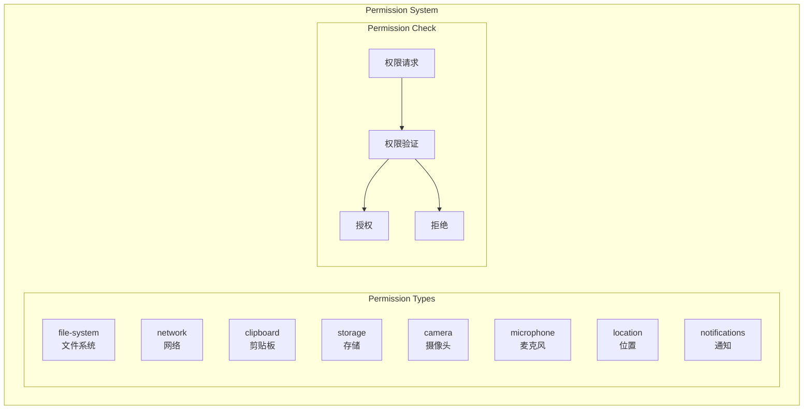

### 权限级别

| 权限 | 描述 | 风险等级 |
|------|------|----------|
| `file-system` | 访问文件系统 | 高 |
| `network` | 网络请求 | 中 |
| `clipboard` | 剪贴板访问 | 低 |
| `storage` | 本地存储 | 低 |
| `camera` | 摄像头访问 | 高 |
| `microphone` | 麦克风访问 | 高 |
| `location` | 位置信息 | 中 |
| `notifications` | 系统通知 | 低 |

## 插件示例

### 工具插件示例

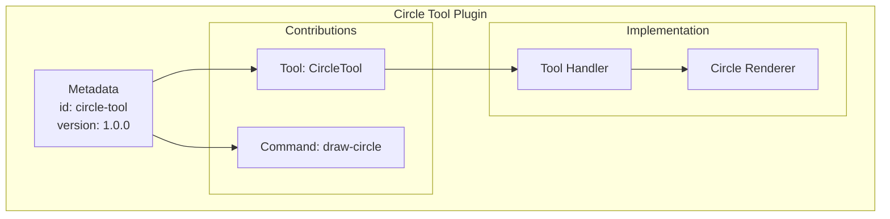

### 滤镜插件示例

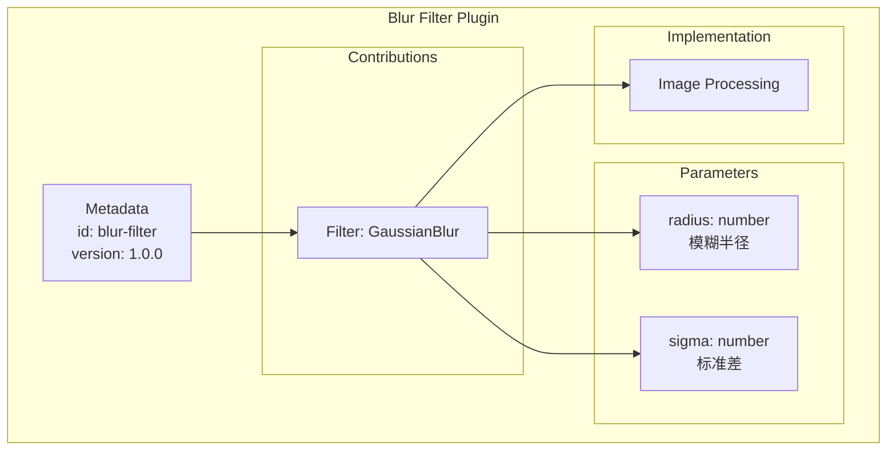

## 插件市场

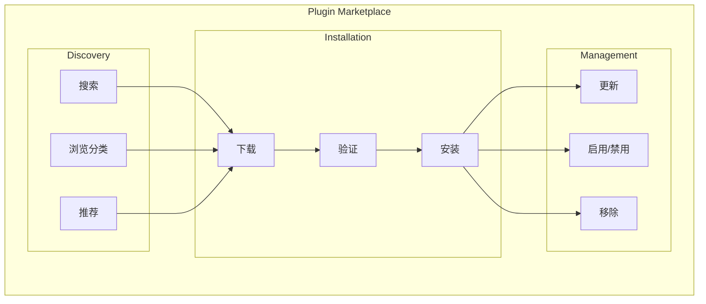

## 最佳实践

### 插件开发建议

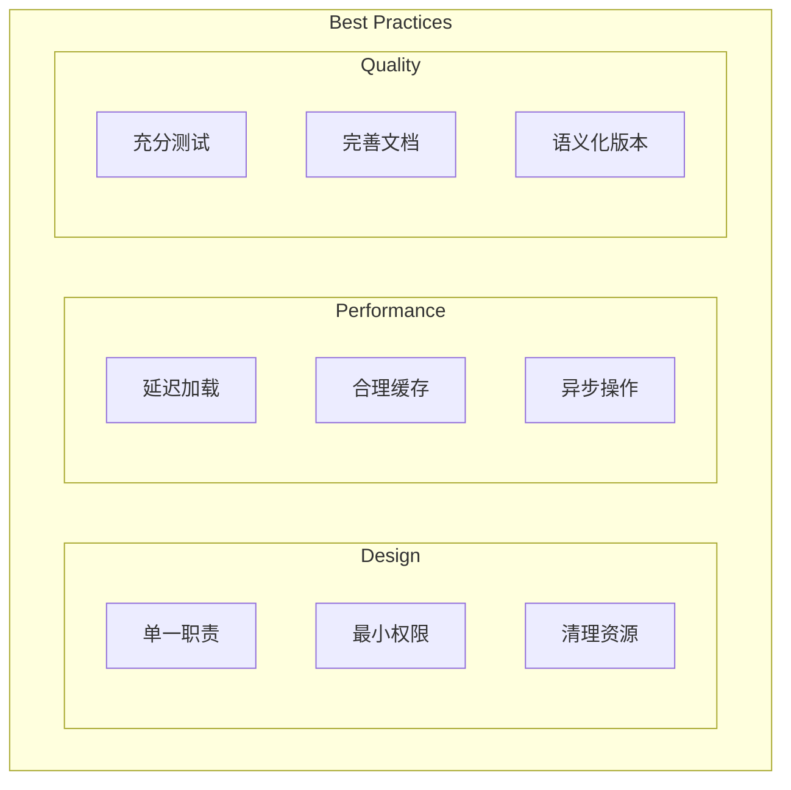

### 安全考虑

| 项目 | 建议 |
|------|------|
| 权限 | 只请求必要的权限 |
| 数据 | 不存储敏感信息 |
| 网络 | 使用 HTTPS |
| 输入 | 验证所有输入 |
| 错误 | 优雅处理错误 |

## 相关文档

- [系统架构概述](./README.md)
- [渲染管线详解](./render-pipeline.md)
