# 渲染管线详解

## 概述

Sky Canvas 的渲染管线是一个多阶段、高性能的渲染系统，支持多线程处理、GPU 驱动渲染和智能批处理优化。

## 渲染管线架构

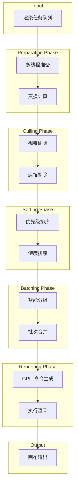

## 渲染阶段详解

### 1. Setup 阶段 (设置)

初始化渲染帧，准备渲染上下文：

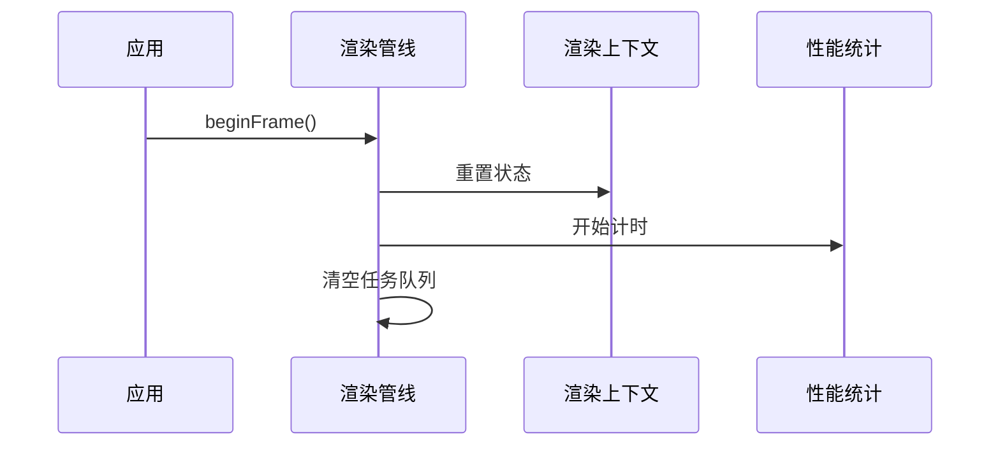

**主要职责**：
- 重置渲染状态
- 清空命令缓冲区
- 初始化帧统计

### 2. Cull 阶段 (剔除)

移除不可见对象，减少渲染负载：

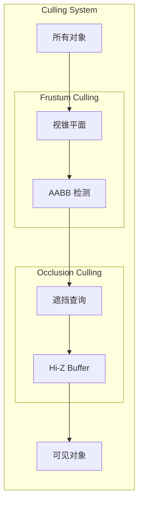

**视锥剔除算法**：
```
对于每个对象的 AABB：
  对于每个视锥平面 (6个)：
    计算 AABB 与平面的关系
    如果完全在平面外侧 → 剔除
  如果通过所有平面检测 → 保留
```

**性能指标**：
- `culledObjects`: 被剔除的对象数量
- 目标剔除率: 40-60% (典型场景)

### 3. Sort 阶段 (排序)

按渲染顺序排列对象：

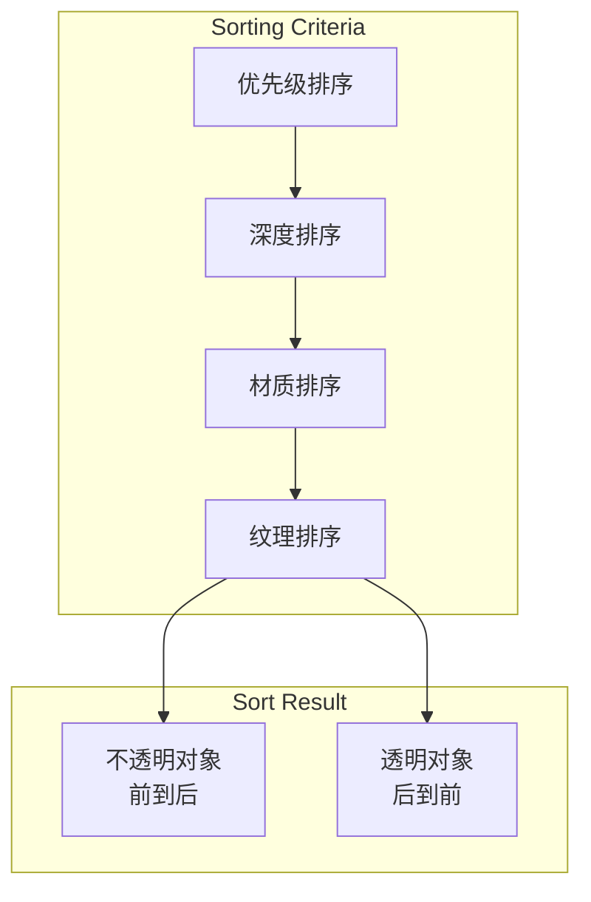

**排序策略**：
1. **优先级排序**: 高优先级任务先渲染
2. **深度排序**: 
   - 不透明对象: 前到后 (利用深度测试早期剔除)
   - 透明对象: 后到前 (正确的混合顺序)
3. **状态排序**: 减少状态切换

### 4. Batch 阶段 (批处理)

合并相似的渲染调用：

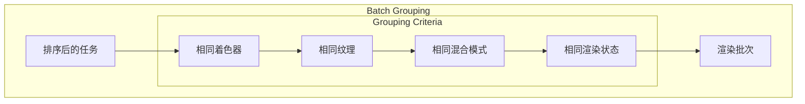

**批处理系统架构**：

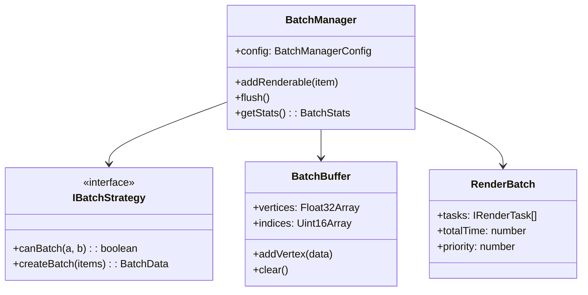

**批处理优化效果**：
- 减少 Draw Calls: 60-80%
- 减少状态切换: 50-70%
- 提升帧率: 2-3x

### 5. Render 阶段 (渲染)

执行实际的 GPU 渲染命令：

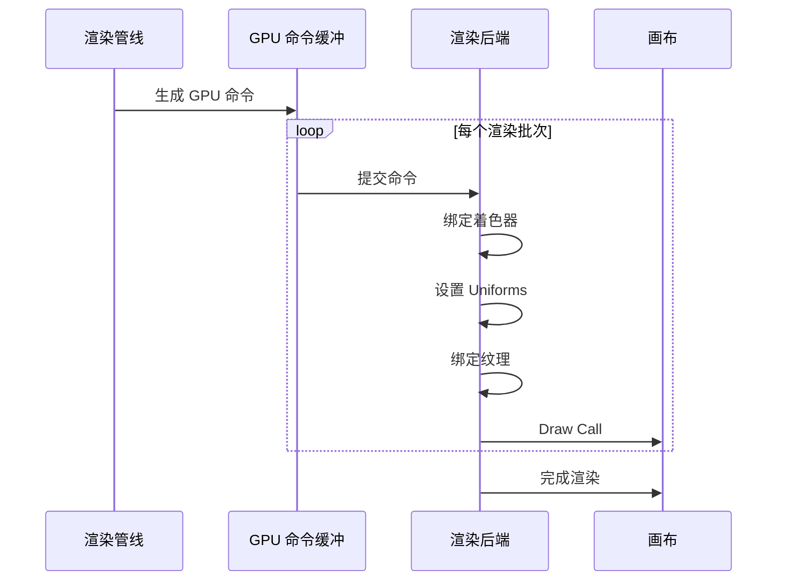

**GPU 命令类型**：
- `draw`: 绘制命令
- `compute`: 计算命令
- `copy`: 复制命令

### 6. PostProcess 阶段 (后处理)

应用后处理效果：

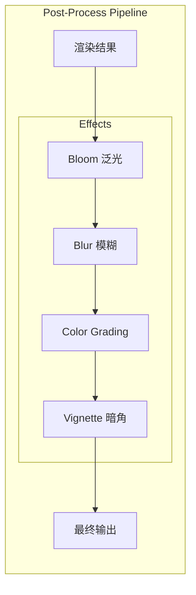

### 7. Present 阶段 (呈现)

将渲染结果呈现到屏幕：

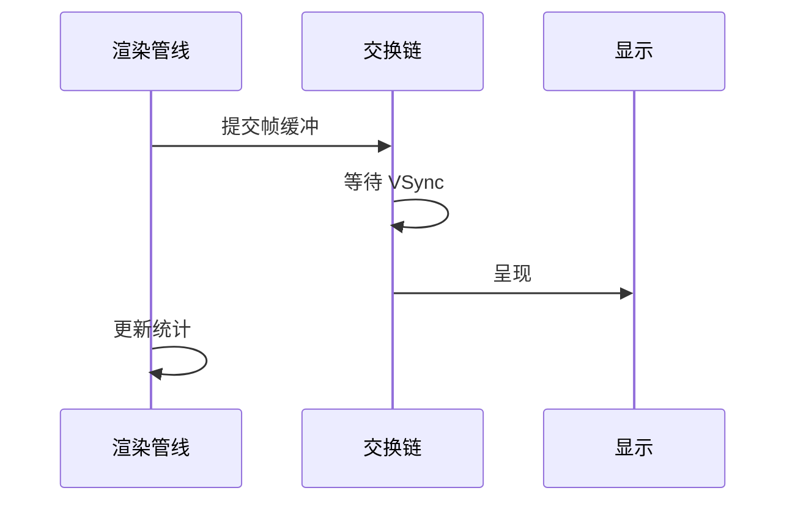

## 多线程渲染

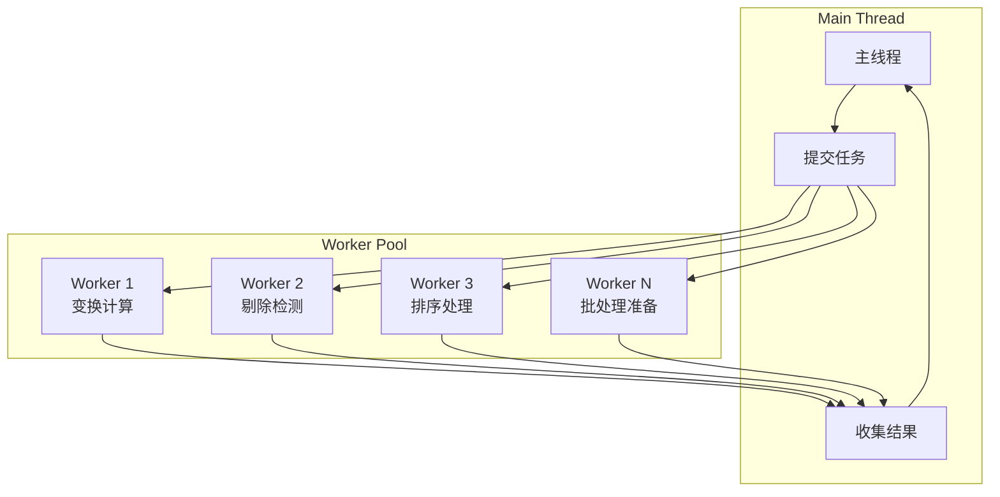

**Worker 任务分配**：
```
任务数 / Worker数 = 每个 Worker 的任务量
并行处理 → Promise.all() 等待完成
```

## 渲染后端适配

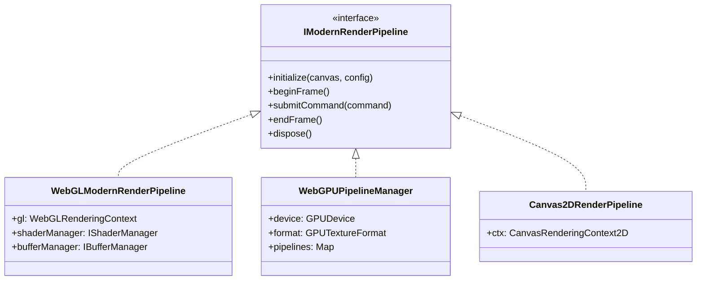

### WebGL 渲染管线

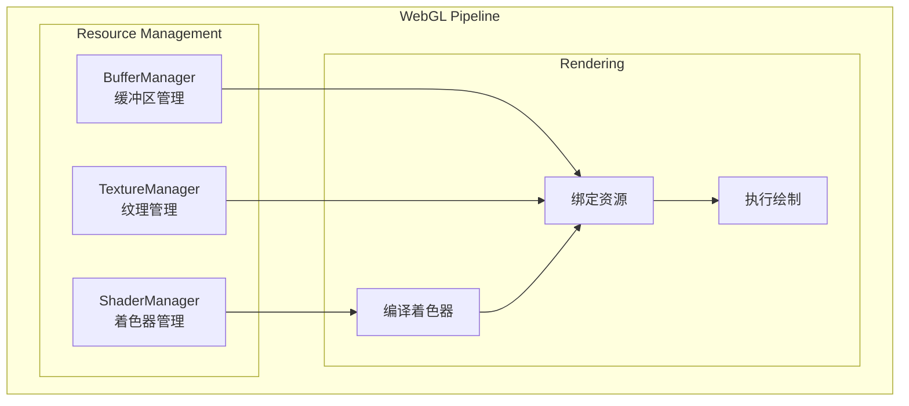

### WebGPU 渲染管线

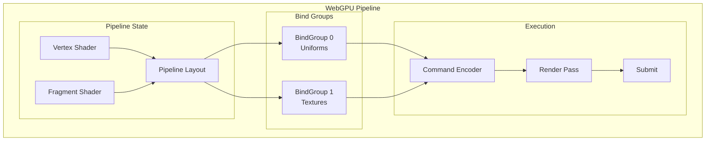

## 性能监控

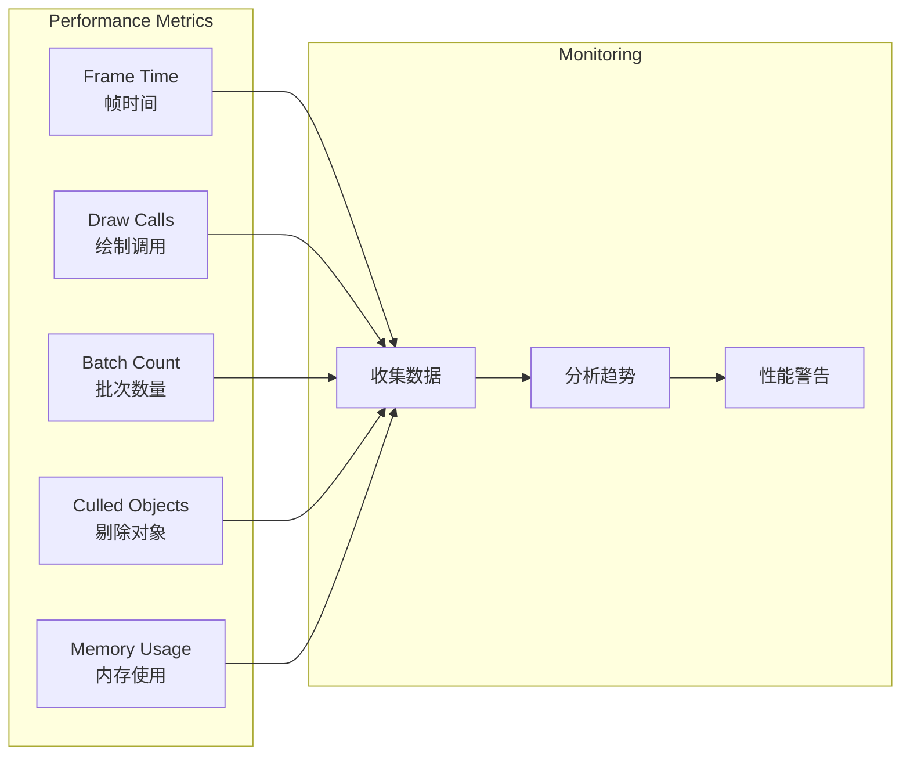

**关键性能指标**：

| 指标 | 描述 | 目标值 |
|------|------|--------|
| `frameTime` | 单帧渲染时间 | < 16.67ms (60fps) |
| `drawCalls` | GPU 绘制调用次数 | < 100 |
| `batchCount` | 渲染批次数量 | < 50 |
| `triangles` | 渲染三角形数量 | < 100K |
| `textureBinds` | 纹理绑定次数 | < 20 |
| `shaderSwitches` | 着色器切换次数 | < 10 |

## 自适应质量管理

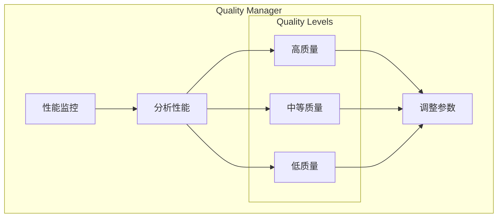

**自适应策略**：
- 帧率下降 → 降低质量等级
- 帧率稳定 → 尝试提升质量
- 内存压力 → 减少缓存大小

## 渲染配置

```typescript
interface RenderConfig {
  enableBatching: boolean;      // 启用批处理
  enableCulling: boolean;       // 启用剔除
  enableLOD: boolean;           // 启用 LOD
  enableOcclusion: boolean;     // 启用遮挡剔除
  enableInstancing: boolean;    // 启用实例化
  enableAsyncLoading: boolean;  // 启用异步加载
  enablePredictiveCache: boolean; // 启用预测缓存
  enableDynamicOptimization: boolean; // 启用动态优化
  maxConcurrentTasks: number;   // 最大并发任务数
  adaptiveQuality: boolean;     // 自适应质量
}
```

## 性能预算

```typescript
interface PerformanceBudget {
  targetFPS: number;        // 目标帧率 (默认: 60)
  maxFrameTime: number;     // 最大帧时间 (默认: 16.67ms)
  maxDrawCalls: number;     // 最大绘制调用 (默认: 100)
  maxTriangles: number;     // 最大三角形数 (默认: 100000)
  maxMemoryUsage: number;   // 最大内存使用 (默认: 512MB)
  maxGPUMemory: number;     // 最大 GPU 内存 (默认: 256MB)
}
```

## 调度系统

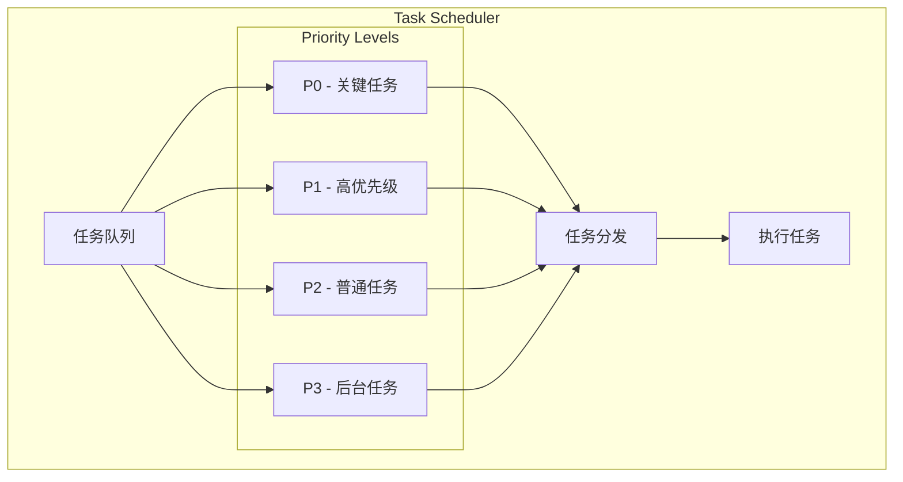

## 相关文档

- [系统架构概述](./README.md)
- [插件系统架构](./plugin-system.md)
- [性能优化指南](../PERFORMANCE.md)
