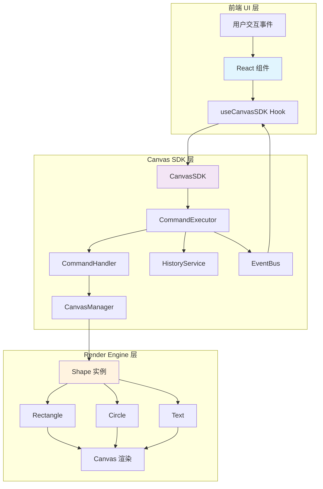
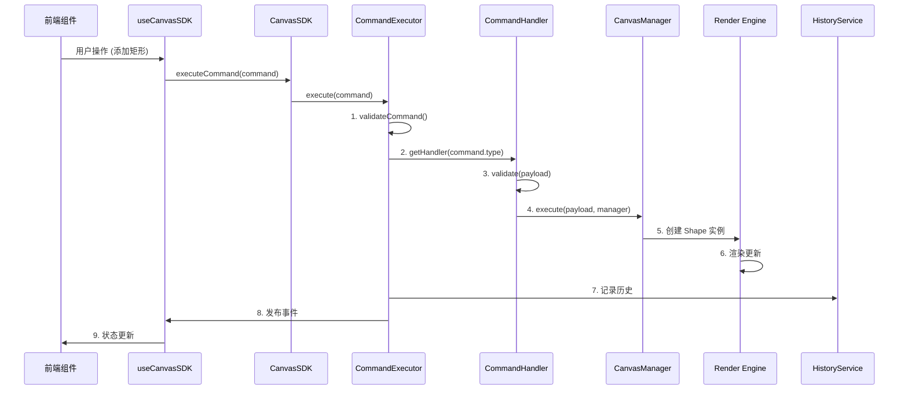
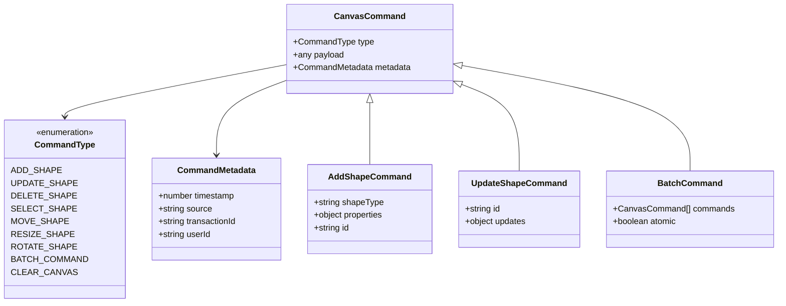
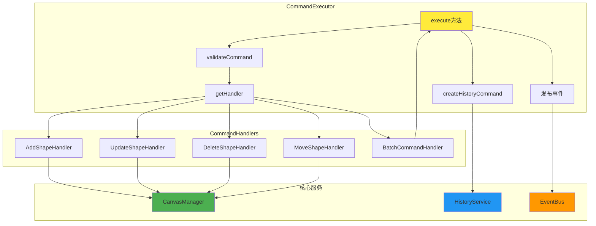
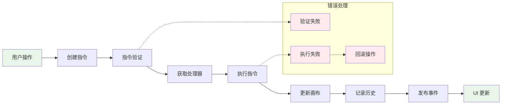
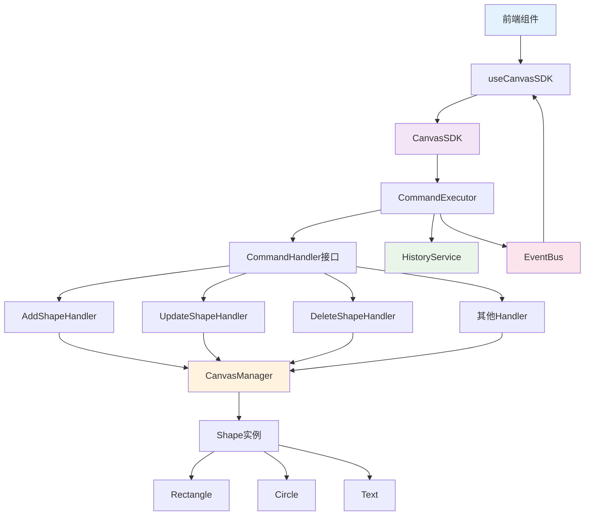
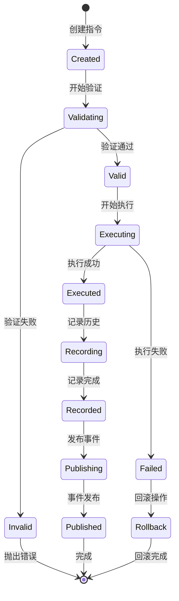

# Sky Canvas 指令系统架构图 (Mermaid)

## 1. 整体架构图

## 2. 指令执行流程图

## 3. 指令类型结构图

## 4. 指令处理器架构图

## 5. 数据流向图

## 6. 组件依赖关系图

## 7. 指令生命周期图

## 使用说明

这些 Mermaid 图表可以直接在支持 Mermaid 的 Markdown 编辑器中渲染，如：
- GitHub
- GitLab
- Notion
- Typora
- VS Code (with Mermaid extension)

或者可以使用在线工具：
- [Mermaid Live Editor](https://mermaid.live/)
- [Mermaid Chart](https://www.mermaidchart.com/)