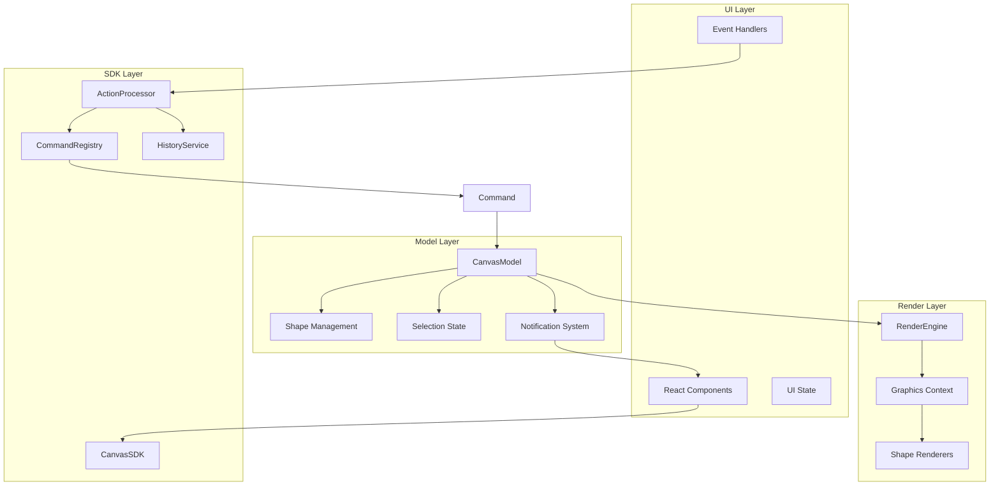

# Command-Action 系统实施指南

## 项目概述

本文档提供了 Sky Canvas Command-Action 系统的完整实施指南，包括架构设计、开发流程、测试策略和部署建议。

## 架构设计

### 系统架构图



### 核心组件关系

1. **UI Layer** → **SDK Layer**: 用户交互转换为 Action
2. **SDK Layer** → **Model Layer**: Action 通过 Command 修改模型
3. **Model Layer** → **Render Layer**: 状态变化触发渲染
4. **Model Layer** → **UI Layer**: 通知系统更新界面

## 开发流程

### 1. 需求分析

#### 功能需求模板

```markdown
## 功能：[功能名称]

### 用户故事
作为 [角色]，我希望 [功能]，以便 [目标]。

### 接受标准
- [ ] 用户可以通过 [交互方式] 触发操作
- [ ] 系统能够 [预期行为]
- [ ] 操作支持撤销/重做
- [ ] 错误情况有适当的提示

### 技术要求
- Action 类型：`[ACTION_NAME]`
- Command 类型：`[CommandName]`
- 影响的模型状态：[描述]
- 所需的 UI 更新：[描述]
```

#### Action 设计检查清单

- [ ] **类型命名**：使用大写和下划线（如 `ADD_RECTANGLE`）
- [ ] **Payload 设计**：包含所有必要数据，避免冗余
- [ ] **元数据完整**：包含时间戳、来源、用户信息
- [ ] **向后兼容**：考虑版本升级的兼容性

### 2. Action 定义

#### 标准 Action 模板

```typescript
// types/actions/[feature].ts
export interface [FeatureName]Action extends BaseAction {
  type: '[ACTION_TYPE]';
  payload: {
    // 必需参数
    requiredParam: string;

    // 可选参数
    optionalParam?: number;

    // 配置参数
    options?: {
      immediate?: boolean;
      skipValidation?: boolean;
    };
  };
}

// 导出类型联合
export type [Feature]Actions =
  | [Action1]
  | [Action2]
  | [Action3];
```

#### Payload 设计原则

```typescript
// ✅ 好的设计
interface AddShapeActionPayload {
  shapeType: ShapeType;           // 明确的类型
  position: Point;                // 使用语义化的类型
  size: Size;                     // 分离关注点
  style?: ShapeStyle;             // 可选配置
  selectAfterAdd?: boolean;       // 行为控制选项
}

// ❌ 避免的设计
interface BadActionPayload {
  x: number;                      // 过于底层
  y: number;
  data: any;                      // 类型不明确
  config: Record<string, any>;    // 缺乏结构
}
```

### 3. Command 实现

#### Command 开发模板

```typescript
// commands/[feature]/[CommandName].ts
export class [CommandName] extends [BaseType] {
  private readonly originalState: [StateType];
  private readonly targetState: [StateType];

  constructor(
    model: CanvasModel,
    private readonly payload: [ActionPayload]
  ) {
    super(model, '[Command Description]');

    // 记录原始状态
    this.originalState = this.captureState();

    // 计算目标状态
    this.targetState = this.calculateTargetState();

    // 验证操作
    this.validateOperation();
  }

  async execute(): Promise<void> {
    try {
      // 执行前检查
      this.preExecutionCheck();

      // 执行核心逻辑
      await this.performOperation();

      // 执行后处理
      this.postExecutionProcessing();

      // 标记为已执行
      this.markAsExecuted();

    } catch (error) {
      // 错误恢复
      await this.recoverFromError(error);
      throw error;
    }
  }

  async undo(): Promise<void> {
    if (!this.isCommandExecuted()) {
      return;
    }

    // 恢复到原始状态
    await this.restoreState(this.originalState);

    // 标记为未执行
    this.markAsNotExecuted();
  }

  private captureState(): [StateType] {
    // 捕获当前状态
    return {
      // ... 状态数据
    };
  }

  private calculateTargetState(): [StateType] {
    // 根据 payload 计算目标状态
    return {
      // ... 目标状态
    };
  }

  private validateOperation(): void {
    // 验证操作是否可执行
    if (/* 验证条件 */) {
      throw new Error('Operation validation failed');
    }
  }

  private async performOperation(): Promise<void> {
    // 核心业务逻辑
  }
}
```

#### Command 实现最佳实践

```typescript
// ✅ 好的实现
export class MoveShapeCommand extends SyncCommand {
  private readonly shapeId: string;
  private readonly oldPosition: Point;
  private readonly newPosition: Point;

  constructor(model: CanvasModel, payload: MoveShapePayload) {
    super(model, `Move shape ${payload.shapeId}`);

    this.shapeId = payload.shapeId;

    const shape = this.model.getShape(this.shapeId);
    if (!shape) {
      throw new Error(`Shape ${this.shapeId} not found`);
    }

    this.oldPosition = { x: shape.x, y: shape.y };
    this.newPosition = payload.position;
  }

  execute(): void {
    const success = this.model.updateShape(this.shapeId, {
      x: this.newPosition.x,
      y: this.newPosition.y
    });

    if (!success) {
      throw new Error(`Failed to move shape ${this.shapeId}`);
    }

    this.markAsExecuted();
  }

  undo(): void {
    this.model.updateShape(this.shapeId, {
      x: this.oldPosition.x,
      y: this.oldPosition.y
    });

    this.markAsNotExecuted();
  }
}
```

### 4. 集成开发

#### ActionProcessor 配置

```typescript
// config/processor.ts
export function createActionProcessor(model: CanvasModel): ActionProcessor {
  return new ActionProcessor(model, {
    enableValidation: process.env.NODE_ENV === 'development',
    enableLogging: process.env.NODE_ENV === 'development',

    errorRetry: {
      maxRetries: 3,
      retryableErrors: ['NetworkError', 'TimeoutError'],
      backoffMs: 1000
    },

    performance: {
      enabled: true,
      slowThreshold: 100,
      statsWindow: 100,
      memoryTracking: process.env.NODE_ENV === 'development'
    }
  });
}
```

#### 命令注册策略

```typescript
// registry/index.ts
export function registerAllCommands(): void {
  // 按功能模块注册
  registerShapeCommands();
  registerSelectionCommands();
  registerZIndexCommands();
  registerFileCommands();

  // 注册插件命令
  registerPluginCommands();

  console.log('All commands registered:', commandRegistry.getStats());
}

function registerShapeCommands(): void {
  const shapeCommands = {
    'ADD_RECTANGLE': AddRectangleCommand,
    'ADD_CIRCLE': AddCircleCommand,
    'ADD_TEXT': AddTextCommand,
    'UPDATE_SHAPE': UpdateShapeCommand,
    'DELETE_SHAPE': DeleteShapeCommand,
  };

  Object.entries(shapeCommands).forEach(([type, CommandClass]) => {
    commandRegistry.register(type, {
      factory: (model, action) => new CommandClass(model, action.payload),
      description: `Shape command: ${type}`,
      category: 'shape'
    });
  });
}
```

### 5. 错误处理策略

#### 分层错误处理

```typescript
// errors/index.ts
export abstract class CanvasError extends Error {
  abstract readonly code: string;
  abstract readonly category: string;

  constructor(message: string, public readonly context?: any) {
    super(message);
    this.name = this.constructor.name;
  }
}

export class ValidationError extends CanvasError {
  readonly code = 'VALIDATION_ERROR';
  readonly category = 'user';
}

export class ExecutionError extends CanvasError {
  readonly code = 'EXECUTION_ERROR';
  readonly category = 'system';
}

export class NetworkError extends CanvasError {
  readonly code = 'NETWORK_ERROR';
  readonly category = 'external';
}
```

#### 错误恢复机制

```typescript
// processors/ErrorRecoveryProcessor.ts
export class ErrorRecoveryProcessor {
  constructor(private processor: ActionProcessor) {
    this.setupErrorHandlers();
  }

  private setupErrorHandlers(): void {
    this.processor.on('command-failed', async (command, error) => {
      const recovery = this.getRecoveryStrategy(error);
      if (recovery) {
        await this.executeRecovery(command, recovery);
      }
    });
  }

  private getRecoveryStrategy(error: Error): RecoveryStrategy | null {
    if (error instanceof NetworkError) {
      return new NetworkErrorRecovery();
    }

    if (error instanceof ValidationError) {
      return new ValidationErrorRecovery();
    }

    return null;
  }

  private async executeRecovery(
    command: Command,
    recovery: RecoveryStrategy
  ): Promise<void> {
    try {
      await recovery.recover(command);
      console.log(`Recovery successful for ${command.toString()}`);
    } catch (recoveryError) {
      console.error('Recovery failed:', recoveryError);
    }
  }
}
```

## 测试策略

### 1. 单元测试

#### Command 测试模板

```typescript
// __tests__/commands/CommandName.test.ts
describe('CommandName', () => {
  let model: CanvasModel;
  let command: CommandName;

  beforeEach(() => {
    model = new CanvasModel();
    // 设置测试数据
  });

  afterEach(() => {
    model.dispose();
  });

  describe('执行', () => {
    it('应该正确执行操作', async () => {
      // Arrange
      const payload = createTestPayload();
      command = new CommandName(model, payload);

      // Act
      await command.execute();

      // Assert
      expect(command.isCommandExecuted()).toBe(true);
      expect(/* 验证状态变化 */).toBe(/* 期望值 */);
    });

    it('应该处理执行错误', async () => {
      // Arrange
      const invalidPayload = createInvalidPayload();
      command = new CommandName(model, invalidPayload);

      // Act & Assert
      await expect(command.execute()).rejects.toThrow();
      expect(command.isCommandExecuted()).toBe(false);
    });
  });

  describe('撤销', () => {
    it('应该正确撤销操作', async () => {
      // Arrange
      const payload = createTestPayload();
      command = new CommandName(model, payload);
      const originalState = captureModelState(model);

      // Act
      await command.execute();
      await command.undo();

      // Assert
      expect(command.isCommandExecuted()).toBe(false);
      expect(/* 验证状态恢复 */).toEqual(originalState);
    });
  });
});
```

#### ActionProcessor 集成测试

```typescript
// __tests__/integration/processor.test.ts
describe('ActionProcessor Integration', () => {
  let model: CanvasModel;
  let processor: ActionProcessor;

  beforeEach(async () => {
    model = new CanvasModel();
    processor = new ActionProcessor(model);
    registerAllCommands();
  });

  it('应该完成完整的操作流程', async () => {
    // Arrange
    const action: Action = {
      type: 'ADD_RECTANGLE',
      payload: {
        x: 100, y: 100,
        width: 200, height: 150
      },
      metadata: {
        timestamp: Date.now(),
        source: 'user'
      }
    };

    // Act
    const result = await processor.process(action);

    // Assert
    expect(result.success).toBe(true);
    expect(result.command).toBeDefined();
    expect(model.getShapeCount()).toBe(1);

    // 测试撤销
    const undoResult = await processor.undo();
    expect(undoResult).toBe(true);
    expect(model.getShapeCount()).toBe(0);
  });
});
```

### 2. 性能测试

#### 性能基准测试

```typescript
// __tests__/performance/benchmark.test.ts
describe('Performance Benchmarks', () => {
  let model: CanvasModel;
  let processor: ActionProcessor;

  beforeEach(() => {
    model = new CanvasModel();
    processor = new ActionProcessor(model);
    registerAllCommands();
  });

  it('应该高效处理大量操作', async () => {
    const startTime = performance.now();
    const operations = 1000;

    // 创建大量操作
    const promises = Array.from({ length: operations }, (_, i) =>
      processor.process({
        type: 'ADD_RECTANGLE',
        payload: {
          x: i * 10,
          y: i * 5,
          width: 50,
          height: 30
        },
        metadata: {
          timestamp: Date.now(),
          source: 'user'
        }
      })
    );

    await Promise.all(promises);

    const endTime = performance.now();
    const totalTime = endTime - startTime;
    const avgTime = totalTime / operations;

    console.log(`${operations} operations completed in ${totalTime.toFixed(2)}ms`);
    console.log(`Average time per operation: ${avgTime.toFixed(2)}ms`);

    // 性能断言
    expect(avgTime).toBeLessThan(10); // 每个操作应该在10ms内完成
    expect(model.getShapeCount()).toBe(operations);
  });

  it('应该高效处理撤销操作', async () => {
    // 先创建一些操作
    for (let i = 0; i < 100; i++) {
      await processor.process({
        type: 'ADD_RECTANGLE',
        payload: { x: i, y: i, width: 10, height: 10 },
        metadata: { timestamp: Date.now(), source: 'user' }
      });
    }

    // 测试批量撤销性能
    const startTime = performance.now();

    while (processor.getHistoryStats().canUndo) {
      await processor.undo();
    }

    const endTime = performance.now();
    const totalTime = endTime - startTime;

    console.log(`100 undo operations completed in ${totalTime.toFixed(2)}ms`);

    expect(totalTime).toBeLessThan(1000); // 100次撤销应该在1秒内完成
    expect(model.getShapeCount()).toBe(0);
  });
});
```

### 3. 端到端测试

#### E2E 测试场景

```typescript
// __tests__/e2e/canvas-workflow.test.ts
describe('Canvas Workflow E2E', () => {
  it('应该支持完整的用户工作流', async () => {
    // 1. 创建形状
    await page.click('[data-testid="rectangle-tool"]');
    await page.click('[data-testid="canvas"]', { position: { x: 100, y: 100 } });
    await page.drag(/* 拖拽参数 */);

    // 验证形状创建
    const shapeCount = await page.locator('[data-testid="shape-item"]').count();
    expect(shapeCount).toBe(1);

    // 2. 选择形状
    await page.click('[data-testid="shape-item"]:first-child');

    // 验证选择状态
    const isSelected = await page.locator('[data-testid="shape-item"]:first-child')
      .getAttribute('data-selected');
    expect(isSelected).toBe('true');

    // 3. 修改属性
    await page.fill('[data-testid="fill-color"]', '#ff0000');
    await page.press('[data-testid="fill-color"]', 'Enter');

    // 验证属性更改
    const fillColor = await page.locator('[data-testid="shape-item"]:first-child')
      .getAttribute('data-fill');
    expect(fillColor).toBe('#ff0000');

    // 4. 撤销操作
    await page.keyboard.press('Control+Z');

    // 验证撤销结果
    const undoFillColor = await page.locator('[data-testid="shape-item"]:first-child')
      .getAttribute('data-fill');
    expect(undoFillColor).not.toBe('#ff0000');

    // 5. 重做操作
    await page.keyboard.press('Control+Y');

    // 验证重做结果
    const redoFillColor = await page.locator('[data-testid="shape-item"]:first-child')
      .getAttribute('data-fill');
    expect(redoFillColor).toBe('#ff0000');
  });
});
```

## 部署和监控

### 1. 构建配置

#### Webpack 配置优化

```javascript
// webpack.config.js
module.exports = {
  // ... 其他配置

  optimization: {
    splitChunks: {
      chunks: 'all',
      cacheGroups: {
        // 将 Command 系统单独打包
        commands: {
          test: /[\\/]commands[\\/]/,
          name: 'commands',
          chunks: 'all',
          priority: 10,
        },

        // 将 Actions 和 Models 单独打包
        core: {
          test: /[\\/](actions|models)[\\/]/,
          name: 'core',
          chunks: 'all',
          priority: 15,
        }
      }
    }
  },

  // 开发环境配置
  ...(process.env.NODE_ENV === 'development' && {
    devtool: 'inline-source-map',
    plugins: [
      new webpack.DefinePlugin({
        'process.env.ENABLE_COMMAND_DEBUGGING': JSON.stringify(true),
        'process.env.ENABLE_PERFORMANCE_MONITORING': JSON.stringify(true)
      })
    ]
  })
};
```

### 2. 运行时监控

#### 性能监控系统

```typescript
// monitoring/PerformanceMonitor.ts
export class PerformanceMonitor {
  private metrics = new Map<string, PerformanceMetric[]>();

  constructor(private processor: ActionProcessor) {
    this.setupMonitoring();
  }

  private setupMonitoring(): void {
    this.processor.on('command-executed', (command, result) => {
      this.recordMetric('command-execution', {
        commandType: command.constructor.name,
        executionTime: result.executionTime,
        success: result.success,
        timestamp: Date.now()
      });

      // 检查慢操作
      if (result.executionTime > 100) {
        console.warn(`Slow command detected: ${command.toString()} took ${result.executionTime}ms`);
      }
    });

    this.processor.on('action-retry', (action, attempt) => {
      this.recordMetric('action-retry', {
        actionType: action.type,
        attempt,
        timestamp: Date.now()
      });
    });
  }

  private recordMetric(type: string, data: any): void {
    if (!this.metrics.has(type)) {
      this.metrics.set(type, []);
    }

    const metrics = this.metrics.get(type)!;
    metrics.push(data);

    // 保持最近1000条记录
    if (metrics.length > 1000) {
      metrics.splice(0, metrics.length - 1000);
    }
  }

  getMetrics(type: string): PerformanceMetric[] {
    return this.metrics.get(type) || [];
  }

  getStats(): MonitoringStats {
    const commandMetrics = this.getMetrics('command-execution');
    const retryMetrics = this.getMetrics('action-retry');

    return {
      totalCommands: commandMetrics.length,
      averageExecutionTime: this.calculateAverage(commandMetrics, 'executionTime'),
      slowCommands: commandMetrics.filter(m => m.executionTime > 100).length,
      failedCommands: commandMetrics.filter(m => !m.success).length,
      retryCount: retryMetrics.length
    };
  }

  private calculateAverage(metrics: PerformanceMetric[], field: string): number {
    if (metrics.length === 0) return 0;
    const sum = metrics.reduce((acc, m) => acc + (m[field] || 0), 0);
    return sum / metrics.length;
  }
}
```

#### 错误报告系统

```typescript
// monitoring/ErrorReporter.ts
export class ErrorReporter {
  constructor(
    private processor: ActionProcessor,
    private reportingEndpoint: string
  ) {
    this.setupErrorReporting();
  }

  private setupErrorReporting(): void {
    this.processor.on('command-failed', (command, error) => {
      this.reportError({
        type: 'command-execution-error',
        command: command.toString(),
        error: error.message,
        stack: error.stack,
        timestamp: Date.now(),
        userAgent: navigator.userAgent,
        url: window.location.href
      });
    });

    this.processor.on('action-error', (action, error) => {
      this.reportError({
        type: 'action-processing-error',
        action: action.type,
        payload: action.payload,
        error: error.message,
        timestamp: Date.now()
      });
    });

    // 捕获未处理的 Promise 拒绝
    window.addEventListener('unhandledrejection', (event) => {
      this.reportError({
        type: 'unhandled-promise-rejection',
        error: event.reason?.message || 'Unknown error',
        stack: event.reason?.stack,
        timestamp: Date.now()
      });
    });
  }

  private async reportError(errorData: ErrorReport): Promise<void> {
    try {
      await fetch(this.reportingEndpoint, {
        method: 'POST',
        headers: {
          'Content-Type': 'application/json'
        },
        body: JSON.stringify({
          ...errorData,
          version: process.env.REACT_APP_VERSION,
          environment: process.env.NODE_ENV
        })
      });
    } catch (reportingError) {
      console.error('Failed to report error:', reportingError);
    }
  }
}
```

### 3. 生产环境优化

#### 配置管理

```typescript
// config/production.ts
export const productionConfig = {
  processor: {
    enableValidation: false,
    enableLogging: false,
    errorRetry: {
      maxRetries: 2,
      retryableErrors: ['NetworkError'],
      backoffMs: 500
    }
  },

  history: {
    maxSize: 50, // 限制历史记录大小
    autoCleanup: true
  },

  performance: {
    enabled: true,
    slowThreshold: 200,
    statsWindow: 50,
    memoryTracking: false
  }
};
```

## 最佳实践总结

### 1. 开发原则

- **单一职责**：每个 Command 只处理一种操作
- **不可变性**：Action 和状态应该是不可变的
- **可测试性**：设计时考虑测试的便利性
- **性能优先**：避免不必要的计算和内存分配

### 2. 代码组织

```
src/
├── actions/
│   ├── types/          # Action 类型定义
│   ├── creators/       # Action 创建函数
│   └── validators/     # Action 验证逻辑
├── commands/
│   ├── base/          # 基础命令类
│   ├── shapes/        # 形状相关命令
│   ├── selection/     # 选择相关命令
│   └── async/         # 异步命令
├── models/
│   ├── CanvasModel.ts # 核心模型
│   └── types.ts       # 模型类型定义
├── processors/
│   ├── ActionProcessor.ts
│   └── extensions/    # 处理器扩展
└── registry/
    ├── CommandRegistry.ts
    └── defaults.ts    # 默认命令注册
```

### 3. 版本管理

#### 向后兼容策略

```typescript
// versioning/ActionMigrator.ts
export class ActionMigrator {
  private migrations: Map<string, ActionMigration[]> = new Map();

  registerMigration(actionType: string, migration: ActionMigration): void {
    if (!this.migrations.has(actionType)) {
      this.migrations.set(actionType, []);
    }
    this.migrations.get(actionType)!.push(migration);
  }

  migrateAction(action: Action): Action {
    const migrations = this.migrations.get(action.type);
    if (!migrations) {
      return action;
    }

    return migrations.reduce((acc, migration) => {
      if (migration.shouldMigrate(acc)) {
        return migration.migrate(acc);
      }
      return acc;
    }, action);
  }
}

// 注册迁移规则
migrator.registerMigration('ADD_SHAPE', {
  shouldMigrate: (action) => !action.payload.shapeType,
  migrate: (action) => ({
    ...action,
    payload: {
      ...action.payload,
      shapeType: 'rectangle' // 默认值
    }
  })
});
```

这个实施指南提供了从架构设计到生产部署的完整流程，帮助团队高效地实现 Command-Action 系统。